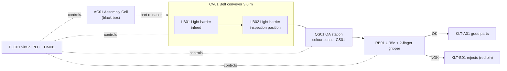
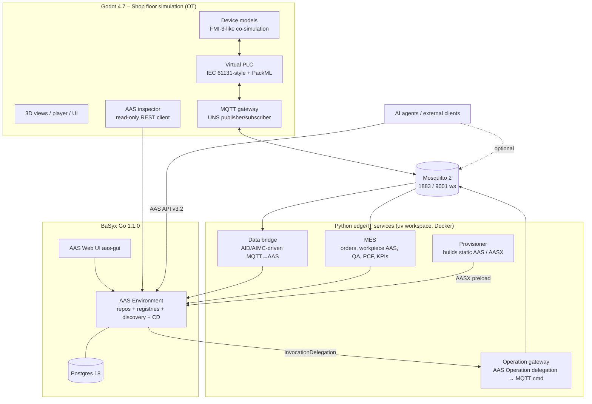
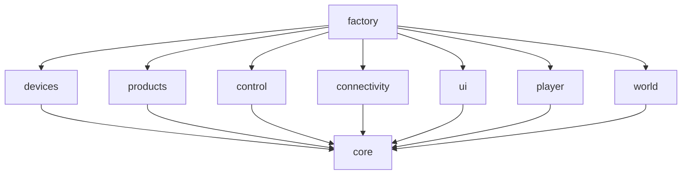

# Virtual Factory: Implementation Plan

> Status: **Draft for review** · 2026-10-03 · Author: Claude (with Aaron Zielstorff)
>
> This plan becomes the seed of the project documentation. Once implementation starts it splits into
> `docs/requirements.md`, `docs/architecture/` (arc42), `docs/interfaces/`, `docs/adr/` and `docs/open-issues.md`.

---

## 0. Decisions taken so far

| # | Topic | Decision |
|---|-------|----------|
| D1 | VR | No VR implementation now. The architecture is **XR-ready**: 1 unit = 1 m, a player-rig abstraction, world-space UI and an XR-capable renderer. |
| D2 | Data flow | **Realistic OT/IT split.** Godot simulates the shop floor (devices + virtual PLC) and publishes MQTT/JSON on a UNS topic tree. The Python edge/IT services (data bridge, MES, operation gateway) write to BaSyx Go. Godot only *reads* AAS. |
| D3 | Product | **Pneumatic cylinder (ISO 15552, Ø32 bore, 80 mm stroke)**. A **red protective end cap** is fitted as the last assembly step. |
| D4 | Audience | Students / AAS education, operator training, AI-agent testbed, demos. |
| D5 | Identity | Fictional manufacturer **VF Pneumatics GmbH**. IDs live under `https://virtual-factory.example/ids/…`. Real purchased equipment (UR5e) keeps its real manufacturer on the nameplate. |
| D6 | OT protocol | MQTT 3.1.1 + JSON, UNS (ISA-95 hierarchy) topics. Godot connects over WebSocket. |
| D7 | BaSyx | Own compose project `vf`, `eclipsebasyx/aasenvironment-go:1.1.0`, no auth, ports that don't conflict with the existing `rebac` stack. |
| D8 | Retention | Workpiece instance AAS are **ephemeral per factory session**. |
| D9 | Language | English code and docs. UI in **German + English** (Godot translation CSV). |
| D10 | Cadence | I work autonomously inside a milestone, send screenshots and renders at key points, and stop for review at the end of each milestone. |
| D11 | Orchestration (M3 review) | **BPMN on MES level** (bpmn.io models, Operaton engine, external tasks in Python); the PLC keeps real-time control (ADR-0016). |
| D12 | Data bridge (M3 review) | Own **AIMC-driven bridge**; not the archived BaSyx DataBridge, not Node-RED in the core path (ADR-0015). |
| D13 | Eventing (M3 review) | BaSyx MQTT eventing **on**; submodel-level only, consumers re-read; core flow does not depend on it. |
| D15 | Operator tasks (M4 review) | BPMN user tasks in the Operaton Tasklist **and** on the in-scene MES terminal / at the KLT. |
| D16 | Inspector data (M4 review) | In-world AAS inspector refreshes via BaSyx MQTT events, then fetch (no polling). |
| D17 | Sandbox (M4 review) | Node-RED as optional learner sandbox (compose profile `sandbox`). |
| D18 | Builds (M5 review) | Desktop builds for macOS, Windows and Linux; no measurement on low-end hardware (budgets suffice). |
| D19 | Scope M6 (M5 review) | Interactive fence door with protective stop and an AAS for the stack light. |
| D14 | Recipe (M3 review) | ISA-88 recipe leads (structure, limits, BPMN procedure model), IDTA ProcessParameters holds the setpoints; referenced, not duplicated. |

---

## 1. Prerequisite check (performed 2026-10-03)

| Item | Status | Notes |
|------|--------|-------|
| Godot | ✅ 4.7.2 stable | `/Applications/Godot.app`. The editor has never been launched (no editor settings yet). The first headless `--import` creates them. |
| Godot MCP (`@coding-solo/godot-mcp@0.1.1`) | ✅ connected | Tools: create scene, add node, run project, debug output, UID tools. **No screenshot or script editing.** I write `.gd`/`.tscn` files directly and take screenshots with an in-project capture hook (`--vf-screenshot=<path>`), falling back to computer-use. |
| Blender | ✅ 5.2.2 LTS, MCP connected | Empty, unsaved scene. Models are built by *versioned Python scripts* run through MCP. |
| Docker | ✅ 29.7.2, Compose v5.5.1 | 14 CPUs and 23 GB RAM for the VM. |
| Python | ✅ 3.12.13 via uv 0.11, `basyx-python-sdk` 2.2.0 | The RWTH `aas-python-http-client` (1.0.3) gets evaluated as the REST client in M3. |
| Git LFS | ✅ 3.8.0, hooks installed | `.gitattributes` already routes `.blend/.glb/.png/.aasx…` through LFS. |
| Node / Java / Go / gh | ✅ 24 / 17 / 1.27 / logged in | Go isn't strictly needed. |
| Ports | ⚠️ 8080, 8082, 3000 taken by the `rebac-*` stack | The VF stack uses **8091** (AAS Environment), **3001** (AAS Web UI), **1883** (MQTT TCP), **9001** (MQTT over WebSocket) **8095** (operation gateway) and **8093** (BaSyx DPP API, ADR-0021). Postgres stays internal only. |
| Godot export templates | ⚠️ missing | Only needed for exported builds (M6). Editor and headless runs don't need them. |
| VR toolchain | ⚠️ none on macOS | No OpenXR runtime and no Android SDK. Acceptable, see D1. |
| GitHub MCP plugin | ⚠️ failed to connect (auth header) | Doesn't matter; the `gh` CLI works. |
| To be installed by me (project-local) | ➕ | GUT 9.6.1 (tests), own GDScript MQTT 3.1.1 client (M4; replaced godot-mqtt V1.4), gdtoolkit (`gdlint`/`gdformat`), `eclipse-mosquitto:2` image, Python: `paho-mqtt`, `httpx`, `pydantic`, `fastapi`+`uvicorn`, `xmlschema`, `aas-test-engines`, `pytest`, `import-linter`. |

**Result: every prerequisite for implementation is met.** The open items are either installed project-locally in M0 or
not needed until later (export templates, VR).

---

## 2. The factory: process and assets

### 2.1 Product: pneumatic cylinder `PC-32-80-DA-M`

The product is a double-acting ISO 15552 profile cylinder from VF Pneumatics GmbH: bore 32 mm, stroke 80 mm, magnetic
piston, M10×1.25 rod thread, roughly 0.6 kg and roughly 225 × 45 × 45 mm. It leaves the assembly cell **standing upright
on its rear end cap**, rod pointing up. The last assembly step presses on a **red PE protective end cap** that covers
the front end cap and the rod thread. Real manufacturers ship cylinders this way so the rod and thread are protected.
The colour sensor above the belt therefore looks straight at the cap:

| Sensor sees | Meaning | Result | Default rate |
|---|---|---|---|
| Red | Cap present, correct variant | **OK → KLT A** | ~92 % |
| Aluminium/grey | Cap missing | **NOK → KLT B** | ~5 % |
| Blue (or another colour) | Wrong cap fitted (variant mix-up) | **NOK → KLT B** | ~3 % |

Defect rates, colour noise and lighting effects can be configured per scenario.

**Bill of materials** (type level, abridged). It feeds both the BoM and the PCF.

| Pos | Item | Material | Qty | Mass |
|---|---|---|---|---|
| 10 | Barrel profile 32×174 mm | Al 6063, anodised | 1 | 0.21 kg |
| 20 | Front end cap | Al die-cast | 1 | 0.09 kg |
| 30 | Rear end cap | Al die-cast | 1 | 0.10 kg |
| 40 | Piston rod Ø12, M10×1.25 | Stainless 1.4301 | 1 | 0.10 kg |
| 50 | Piston with magnet ring | Al + NdFeB | 1 | 0.04 kg |
| 60 | Seal kit (piston, rod, wiper, cushioning, O-rings) | PU / NBR | 1 set | 0.01 kg |
| 70 | Screws M5 (end caps) | Steel 8.8, zinc plated | 8 | 0.03 kg |
| 80 | Cushioning screws | Brass | 2 | 0.01 kg |
| 90 | Protective end cap | PE-LD, **red** | 1 | 0.005 kg |

**Recipe**: an ISA-88 master recipe. The black box performs operations 10–70, the line performs 80–90.
10 rod/piston pre-assembly → 20 seal insertion → 30 barrel insertion → 40 end-cap mounting (torque 6 Nm) → 50 leak test
(6 bar, pressure decay) → 60 function test (stroke time) → 70 fit protective cap → **80 visual inspection** (expected
colour + tolerance) → **90 sort & pack** (KLT, 12 per box).

### 2.2 Line layout and process flow

ISA-95 hierarchy: Enterprise *VF Pneumatics GmbH* › Site *Plant 01* › Area *Final Assembly* › Line *LINE01 – Inspection
& Sorting*.



**Cycle** (default takt 12 s, about 300 parts/h, 1× real time, fast-forward up to 10×):

1. **AC01** (black box) releases a finished cylinder onto the belt infeed when `enable ∧ infeed_free`. It publishes the
   serial number and its own test data (leak rate, stroke time).
2. **LB01** detects the part at the infeed. The PLC pushes the serial into its tracking FIFO and the infeed counts as
   occupied until the part has passed (interlock back to AC01).
3. **CV01** (0.25 m/s, VFD-driven) carries the part to the inspection position.
4. **LB02** is interrupted. After a debounce and positioning delay the PLC stops the belt.
5. **QS01/CS01** measures RGB/hue and compares it with the recipe's taught colour and tolerance. It reports OK/NOK in
   about 300 ms.
6. The PLC commands **RB01** with job `PICK_PLACE`, pick pose = inspection position, target A/B, next slot.
7. RB01 picks (approach → linear down → close gripper → lift), places into the KLT slot, returns home (about 7 s). The
   belt restarts as soon as the part is lifted.
8. When a KLT is full (12 slots) its stack light turns amber and the PLC requests a box exchange. In operator-training
   mode the operator does it; in demo/agent mode it auto-exchanges after a timeout. Meanwhile the line goes to
   PackML *Held* or *Suspended* (configurable).

Further realistic elements: a safety fence with a door switch around RB01 (door open → protective stop), E-stop buttons,
a stack light per cell, a control cabinet with PLC01, HMI01 on a stand, and floor markings.

### 2.3 Device behaviour summary

| Device | Inputs (from PLC/environment) | Outputs | Energy model |
|---|---|---|---|
| AC01 Assembly cell | `enable`, `infeed_free`, recipe params | `part_released` (edge), `serial`, `leak_rate`, `stroke_time`, `state` | 300 W idle / 1.6 kW cycle + compressed-air equivalent |
| CV01 Conveyor | `run`, `speed_setpoint`, `direction` | `belt_speed` (ramped), `belt_position`, `motor_current`, `fault` | 8 W standby / 60–120 W running |
| LB01/LB02 Light barrier | `beam_blocked` (physical, from raycast) | `signal` (debounced, NO/NC configurable), `contamination`, `switch_count` | 1.2 W |
| QS01 / CS01 Colour sensor | `measured_rgb` (physical, from surface probe), `trigger`, `taught_color`, `tolerance` | `r,g,b`, `hue`, `delta_e`, `result_ok`, `result_valid` | 2.5 W + 4 W ring light |
| RB01 UR5e + gripper | `job`, `pick_pose`, `place_target`, `slot`, `start`, `speed_override`, `protective_stop` | `q1..q6`, `qd1..qd6`, `tcp_pose`, `gripper_width`, `busy`, `done`, `program_state`, `cycle_count` | 90 W powered idle, ~150–350 W moving (speed/payload dependent) |
| KLT-A/B | `part_added` | `fill_count`, `full` | — |
| PLC01 | process image | process image, PackML state | 25 W |

All devices integrate `energy_kWh` and `operating_hours`, and expose `power_W`.

---

## 3. Architecture

### 3.1 System context and deployment



**Why this split.** In a real plant, devices don't write to AAS. The PLC talks to field devices, an edge layer moves
data into the IT world, and an MES owns orders and product genealogy. This is the pattern we teach. It also means any
device or the PLC could later be swapped for real hardware or a real PLC (OpenPLC, Codesys) without touching the IT
side.

**Agents** control the factory through **standard AAS Operations** (BaSyx Go delegates them via the
`invocationDelegation` qualifier to the operation gateway) and observe it through submodels, or optionally straight from
MQTT. That gives a clean, standards-based testbed API.

### 3.2 Repository layout

```text
Virtual-Factory/
├── godot/                     # Godot project (res://)
│   ├── core/                  # framework, no domain knowledge
│   │   ├── fmi/               # FMI-3-like API, model-description parser, co-sim master
│   │   ├── plc/               # PLC runtime, IEC FBs (TON, TOF, R_TRIG, CTU…), PackML
│   │   └── util/              # sim clock, logging, object pool
│   ├── devices/               # ONE FOLDER PER DEVICE TYPE (self-contained module)
│   │   ├── conveyor/          # model/ (FMU impl + modelDescription.xml), view/ (glb + binder),
│   │   ├── light_barrier/     #   probes/ (environment sensing), conveyor.tscn,
│   │   ├── color_sensor/      #   device_type.tres, README.md, tests/
│   │   ├── qa_station/
│   │   ├── ur5e/              # + kinematics/ (DH, analytic IK), trajectory/
│   │   ├── gripper_2f/
│   │   ├── assembly_cell/     # the black box
│   │   └── klt_container/
│   ├── products/              # workpiece scene, ProductType resources
│   ├── control/               # PLC programs (SortingLine), IO maps
│   ├── connectivity/          # MQTT gateway, UNS mapping, AAS REST reader
│   ├── factory/               # COMPOSITION ROOT: layout loader, wiring, scenarios
│   ├── world/                 # hall, lighting, props
│   ├── player/                # PlayerRig interface, DesktopRig, (XRRig later)
│   ├── ui/                    # world-space panels, AAS inspector, HMI, i18n
│   ├── config/                # layouts/*.layout.json, uns.json – shared with Python
│   ├── addons/                # gut (third-party)
│   └── tests/                 # integration tests (unit tests live next to modules)
├── services/                  # Python uv workspace
│   ├── vf_common/             # config, ID scheme, AAS builders, REST client
│   ├── provisioner/
│   ├── databridge/
│   ├── mes/
│   └── ops_gateway/
├── aas/                       # asset master data (YAML), CD dictionary, generated AASX (LFS)
├── blender/                   # *.blend sources (LFS) + scripts/ (generators, export)
├── infra/                     # docker-compose.yml, mosquitto/, basyx/
├── tools/                     # arch_check.py, gen_interface_docs.py, screenshot helper
└── docs/                      # requirements, arc42 architecture, interfaces, ADRs, open issues
```

### 3.3 Module dependency rules (the basis for "95 % adherence")



- **`core` depends on nothing.** Every other module depends only on `core`, never sideways.
  - Devices don't know each other.
  - The PLC doesn't know device classes. It only sees its *process image*.
  - The MQTT gateway only sees *tags*.
- **`factory` is the single composition root.** It reads the layout, instantiates device scenes, and wires three kinds
  of connections:
  1. FMU output → FMU/PLC input
  2. PLC tag → UNS topic
  3. device → AAS id
- **Interaction between modules happens only through the FMI variable interface** (value references) and a small set of
  `core` interfaces (`Interactable`, `PlayerRig`, `TagSource`). There's no global event bus with domain events; it's a
  common coupling trap.
- Python: `vf_common` ← services. Services never import each other and communicate only via MQTT or BaSyx. This is
  enforced with `import-linter`.
- **Measured, not claimed:** `tools/arch_check.py` parses `preload/load/extends/class_name` references, builds the
  module graph, checks it against `docs/architecture/dependency-rules.yaml` and reports adherence as a percentage.
  Allowed exceptions are listed with an ADR reference. Target ≥ 95 %.
- **Complexity limits** (via `gdlint`): ≤ 300 lines per file, ≤ 40 lines per function, ≤ 1 class per file. Exceptions
  are documented inline (`# gdlint:ignore` + reason).

### 3.4 FMI-3-aligned device model interface (GDScript)

Each device's *behaviour* is a pure-logic **co-simulation slave** with no rendering and no scene tree access, so it runs
and is testable headless. Its *interface* is described by a genuine **FMI 3.0 `modelDescription.xml`**, validated
against the official FMI 3.0 XSD in CI.

| FMI 3.0 C API | GDScript (`Fmi3CoSimulation` base class) |
|---|---|
| `fmi3InstantiateCoSimulation` | `instantiate(instance_name, instantiation_token, logging_on) -> Fmi3Status` |
| `fmi3EnterInitializationMode` | `enter_initialization_mode(tolerance, start_time, stop_time)` |
| `fmi3ExitInitializationMode` | `exit_initialization_mode()` |
| `fmi3DoStep` | `do_step(current_communication_point, communication_step_size) -> Fmi3DoStepResult` (`status`, `event_handling_needed`, `terminate_simulation`, `early_return`, `last_successful_time`) |
| `fmi3GetFloat64/Int32/UInt64/Boolean/String` | `get_float64(vrs: PackedInt64Array) -> PackedFloat64Array` etc. |
| `fmi3SetFloat64/…` | `set_float64(vrs, values) -> Fmi3Status` etc. |
| `fmi3GetFMUState / SetFMUState` | `get_fmu_state() / set_fmu_state()` (optional; used for scenario snapshots) |
| `fmi3Reset / Terminate / FreeInstance` | `reset() / terminate() / free_instance()` |
| `fmi3Status` | `enum Fmi3Status { OK, WARNING, DISCARD, ERROR, FATAL }` |

Variables follow FMI semantics: `valueReference`, `causality` (parameter/input/output/local), `variability`
(fixed/tunable/discrete/continuous), `unit`, `start`. The **co-simulation master** runs a fixed-step Gauss-Seidel scheme
at the physics tick (60 Hz; the PLC scans every 10 ms of sim time, sub-stepped). Each step:

1. Environment probes sample the physical stimuli (raycasts, surface colour).
2. Inputs are set.
3. `do_step` runs on every device.
4. The PLC scans.
5. Outputs are propagated.
6. View binders animate.

FMI 3 *Clocks* and *Model Exchange* are deliberately out of scope (see ADR). Edges are discrete Boolean outputs.

**Extension point:** an `Fmi3NativeAdapter` (GDExtension wrapping the FMI 3 C API) could load *real* `.fmu` binaries
behind the same interface, e.g. a Modelica conveyor model. The interface needs no changes for that.

### 3.5 Device module anatomy (the unit of extensibility)

```text
devices/light_barrier/
├── model/light_barrier_model.gd     # extends Fmi3CoSimulation (behaviour only)
├── model/modelDescription.xml       # FMI 3.0 interface (single source for the variable list)
├── probes/beam_probe.gd             # RayCast3D → input "beam_blocked"
├── view/light_barrier.glb           # from Blender
├── view/light_barrier_view.gd       # binds outputs → LEDs/animations
├── light_barrier.tscn               # device scene = model holder + probes + view
├── device_type.tres                 # type id, scene, model description, AAS type data, UNS datapoints
├── tests/test_light_barrier_model.gd
└── README.md
```

**Adding a new device type** means adding a new folder plus a layout entry. Nothing else changes.

**Reorganising the factory** means editing `config/layouts/line1.layout.json`, which holds device instances, transforms,
connections, PLC IO map and UNS mapping. It is an SSP-inspired structure, but JSON. A drag-and-drop layout edit mode is
an M5 stretch goal. The same layout file tells the provisioner which machine AAS to create, so there is a **single
source of truth**.

### 3.6 Physics and transport

- The conveyor belt is a `StaticBody3D` with `constant_linear_velocity` set from the FMU output `belt_speed`. Workpieces
  are `RigidBody3D` (Jolt) and are carried realistically: they accumulate when the belt is stopped and slide on the
  belt.
- The belt texture scrolls in a shader and the rollers rotate, both driven by `belt_position`.
- Grasping: when the gripper closes on a part inside its grip zone, the part is frozen and re-parented to the TCP. On
  release it's unfrozen and drops into the KLT.
- Workpieces are pooled, so continuous production doesn't allocate.
- Fallback (if physics proves unstable): a kinematic path follower behind the same conveyor interface (ADR).

### 3.7 Robot (UR5e)

- Real **UR5e DH parameters** (d1 0.1625, a2 −0.425, a3 −0.3922, d4 0.1333, d5 0.0997, d6 0.0996 m), joint limits and
  joint speed limits (180 °/s).
- `ur_kinematics.gd`: forward kinematics plus **closed-form analytic IK** (up to 8 solutions; the one closest to the
  current configuration is chosen; elbow-up enforced).
- `trajectory.gd`: synchronised trapezoidal `movej` and Cartesian `movel` (IK per step), modelled after URScript semantics.
- `ur5e_model.gd`: the FMU plus the program state machine (HOME → APPROACH → DESCEND → GRASP → LIFT → MOVE → PLACE →
  RELEASE → RETREAT → HOME).
- Pick and place poses are computed from the layout (not hard-coded joint angles), so moving the robot, belt or KLTs
  still works after reorganisation.

### 3.8 Virtual PLC and line control

- A cyclic scan with a process image (`%I`, `%Q`, `%M`), plus IEC 61131-3 standard function blocks implemented as small
  classes: `TON`, `TOF`, `TP`, `R_TRIG`, `F_TRIG`, `CTU`, `SR`.
- The program `SortingLine` is written as an SFC-style step chain. A part-tracking FIFO keyed on serial number connects
  AC01 → LB01 → LB02 → QS01 → RB01 → KLT.
- **PackML (ISA-TR88.00.02) unit state machine** for the line: Stopped, Starting, Idle, Execute, Holding/Held,
  Suspending/Suspended, Completing/Complete, Aborting/Aborted, Clearing, Resetting, Stopping. Commands are
  Start/Stop/Hold/Unhold/Suspend/Unsuspend/Reset/Abort/Clear. This is the industry-standard control surface and maps
  cleanly onto agent operations.
- Recipe parameters (takt, belt speed, taught colour, tolerance, KLT capacity) are downloaded from the MES at order start.

### 3.9 UNS topic structure (MQTT)

`vf/plant01/final-assembly/line01/<device>/<class>/<datapoint>` where `<class>` is one of
`state | telemetry | event | cmd | cmd-resp`.

```jsonc
// vf/plant01/final-assembly/line01/cv01/telemetry/belt_speed   (QoS 0)
{ "v": 0.25, "u": "m/s", "ts": "2026-10-03T12:00:00.120Z", "q": "GOOD" }
// vf/plant01/final-assembly/line01/qs01/event/inspection       (QoS 1)
{ "serial": "PC3280-2026-000123", "rgb": [196, 32, 41], "hue": 356.1, "deltaE": 3.2,
  "result": "OK", "station": "QS01", "ts": "…" }
// vf/plant01/final-assembly/line01/plc01/cmd/packml            (QoS 1)
{ "cmd": "Start", "corrId": "7f3c…", "source": "ops-gateway" }
```

- State topics are retained.
- Godot publishes a session birth message (`line01/plc01/state/session`). The MES uses it to start a new session, which
  wipes the previous workpiece instance AAS (D8).
- The topic registry `config/uns.json` is the single source. Docs and the AID submodels are generated from it.
- **As implemented (M4):** see [docs/interfaces/uns.md](interfaces/uns.md); the examples above are the original sketch.

### 3.10 IT services (Python)

| Service | Responsibility | Interfaces |
|---|---|---|
| **provisioner** | Builds all *static* AAS from `aas/data/*.yaml`, the layout and the IDTA templates: product type, machines, line, concept descriptions. Emits AASX into `infra/basyx/preload/`, which BaSyx loads via `GENERAL_AAS_PRECONFIG_PATHS`. Validates with `aas-test-engines`. | Files → BaSyx |
| **databridge** | At startup reads each machine's **Asset Interfaces Description** and **Asset Interfaces Mapping Configuration** submodels *from BaSyx* (AAS-driven, like the BaSyx Java DataBridge). Subscribes to the mapped UNS topics and PATCHes `$value` with throttling (≤ 1 Hz) and a deadband. Maintains the TimeSeries ring buffers. | MQTT → AAS REST |
| **mes** | Session management. Creates the workpiece instance AAS on `part_released`. Records quality, genealogy and process steps. Computes the **instance PCF** (material PCF from the type BoM + allocated process energy × grid factor). Maintains line KPIs (OEE per ISO 22400) and production orders, and downloads recipes to the PLC. | MQTT ↔ AAS REST |
| **ops_gateway** | HTTP endpoint for BaSyx Operation delegation. Translates AAS Operation calls (Start/Stop/Hold/Reset line, CreateOrder, SetSpeedOverride, TeachColor, ExchangeKLT) into MQTT `cmd` messages, waits for `cmd-resp` and returns the output variables. | AAS → HTTP → MQTT |

Model building and serialisation use `basyx-python-sdk` 2.2. REST calls use the RWTH `aas-python-http-client` if it
covers what we need; otherwise a thin `httpx` wrapper in `vf_common`. Decision in M3.

### 3.11 BaSyx Go environment (`infra/docker-compose.yml`, project `vf`)

| Service | Image | Port (host) |
|---|---|---|
| `db` | `postgres:18`, **tmpfs volume**: a fresh DB on every `up`, static AAS preloaded | internal |
| `basyx-config` | `eclipsebasyx/basyxconfigurationservice-go:1.1.0` (one-shot schema setup) | — |
| `aas-env` | `eclipsebasyx/aasenvironment-go:1.1.0` (`SERVER_PORT` set explicitly, ABAC off, registry integration on, CORS for Godot, preload path, `GENERAL_EXTERNALURL`) | **8091** |
| `aas-ui` | `eclipsebasyx/aas-gui` pinned **by digest** (no version tags published) | **3001** |
| `mqtt` | `eclipse-mosquitto:2` (TCP + WebSocket listeners) | **1883 / 9001** |
| `databridge`, `mes`, `ops-gateway` | built from `services/` | 8095 (ops) |

BaSyx Go MQTT eventing (experimental, submodel granularity only) is **on** since M4 (D13): CloudEvents on
`vf/basyx/...`, used by the bridge to reload mappings.

### 3.12 AAS model

#### ID scheme

- `https://virtual-factory.example/ids/aas/<assetTag>`
- `…/ids/asset/<assetTag>`
- `…/ids/sm/<assetTag>/<Submodel>/<version>`
- `…/ids/cd/<name>`
- Serial numbers: `PC3280-YYYY-NNNNNN`

| AAS | Kind | Submodels |
|---|---|---|
| **Product type PC-32-80-DA-M** | Type | DigitalNameplate (IDTA 02006 v3.0), TechnicalData (02003 v2.0), **BillOfMaterial** = HierarchicalStructures enabling BoM (02011 v1.1), **ManufacturingRecipe** (custom, ISA-88 master recipe, referencing **CapabilityDescription** 02020 capabilities), CarbonFootprint (02023 v1.0, declared PCF A1–A3), ContactInformation (02002), HandoverDocumentation (02004, generated datasheet) |
| **Workpiece instance** (one per part) | Instance, `derivedFrom` → type | DigitalNameplate (serial, date of manufacture), **QualityInspection** (custom: assembly-cell test data + colour inspection result, measured values, verdict, station, timestamp), CarbonFootprint (02023, *actual* instance PCF with breakdown), **ProductionLog** (custom: operations with timestamps, resources, KLT destination), HierarchicalStructures (as-built) |
| **Machines** AC01, CV01, LB01, LB02, QS01 (+CS01), RB01 (+GR01), PLC01, KLT-A01/B01 | Instance (with `derivedFrom` device-type AAS for LB, the Type/Instance teaching example) | DigitalNameplate, TechnicalData, ContactInformation, CarbonFootprint (embodied PCF of the device), **OperationalData** (custom: state, power, energy, operating hours, cycles, operational CO₂e), **TimeSeries** (02008 v1.1, power and key signals), **AssetInterfacesDescription** (MQTT/UNS), **AssetInterfacesMappingConfiguration**, **SimulationModels** (IDTA 02005 Provision of Simulation Models, referencing the FMI model description), HandoverDocumentation (optional) |
| **Line LINE01** | Instance | HierarchicalStructures (line → machines), **ProductionKPIs** (aligned with 02066 Process Variables for Manufacturing KPIs / ISO 22400), **LineControl** (custom, with **Operations** delegated to ops_gateway), ProductionCalendar (02067, optional) |

- **Standards adherence:** IDTA templates are used wherever one exists, in their latest published versions with exact
  semantic IDs.
- **Custom submodels**, where no IDTA template exists (energy consumption, quality inspection, recipe, production log),
  get their own semantic IDs, concept descriptions (ECLASS IRDIs where available) and a deviation note in the docs.
- **Metamodel version:** BaSyx Go speaks V3.2 and converts V3.0/3.1 input. Compatibility with SDK 2.2 output gets
  verified in M3 (risk R2).

**Instance PCF (simplified, documented):**

- PCF = Σ(BoM item mass × material emission factor) + Σ_devices(E_device,allocated × grid factor).
- Device energy is allocated over the part's residence time, shared between the parts in process.
- The factors live in `aas/data/emission_factors.yaml` with sources. The grid factor (DE mix) is configurable.

### 3.13 Graphics, performance and XR-readiness

- **Renderer:** *Mobile* (Vulkan/Metal/D3D12, XR-capable, cheap). M1 includes a quick Compatibility (GL) test as a
  fallback for very old hardware, recorded in an ADR. Quality presets: Low / Medium / High.
- **Budgets:**
  - Whole scene ≤ 250 k triangles, ≤ 300 draw calls.
  - Textures mostly ≤ 1K. Colour comes from shared trim/atlas materials or vertex colour.
  - Robot ≤ 12 k triangles, conveyor ≤ 4 k, product ≤ 1.2 k with an automatic LOD.
  - Target **60 FPS at 1080p on an Intel Iris Xe-class iGPU**, leaving headroom for future stereo at 72–90 FPS.
- **Lighting:** baked LightmapGI for the static hall, one directional light, a few spots, one reflection probe. No SDFGI
  or volumetrics.
- **XR-ready rules:**
  - 1 unit = 1 m.
  - All gameplay goes through the `PlayerRig` interface. `DesktopRig` is built now; `XRRig` with XROrigin3D +
    godot-xr-tools comes later.
  - Interactions go through an `Interactable` component (pointer enter/exit/press) that a mouse ray drives today and an
    XR controller ray can drive later.
  - Core UI is **world-space panels** (a SubViewport on a quad). Screen-space HUD only for desktop extras.
  - No hard camera cuts in core flows.

### 3.14 Blender pipeline

- Every asset is generated by a **versioned Python script** (`blender/scripts/build_<asset>.py`) run through the Blender
  MCP, saved as `blender/<asset>.blend` (LFS) and exported to glTF binary (`.glb`) in the device's `view/` folder. That
  keeps the models reproducible, reviewable and easy to tweak.
- **Conventions:**
  - Real-world dimensions.
  - Origins at the pivots.
  - Joints as named empties: `J1_shoulder_pan` … `J6_wrist3`, `TCP`.
  - Godot import hints: `-col` / `-colonly` for collision.
  - Shared materials library, mostly flat-shaded PBR with very few textures.
- **Assets** (triangle budget):

  | Asset | Triangles |
  |---|---|
  | Cylinder product | 1.2 k, 3 variants: red cap / no cap / blue cap |
  | Belt conveyor | 4 k: frame, belt, drive/idler rollers, motor + gearbox, legs, side guides |
  | Light barrier | 0.6 k: sender with LED, reflector on brackets |
  | QA station | 2.5 k: gantry bracket, colour sensor head, ring light |
  | UR5e | 12 k, with characteristic link proportions and joint caps |
  | 2-finger gripper | 2 k |
  | Robot pedestal | 0.5 k |
  | Assembly cell | 6 k: enclosure, window, outlet, HMI, stack light |
  | KLT boxes | 0.8 k, VDA style; red bin for rejects |
  | Control cabinet, HMI stand | — |
  | Safety fence + door | — |
  | Stack lights, E-stops | — |
  | Hall | ~10 k: floor with markings, walls, columns, ceiling lights |
  | Props | pallets, racks |

- **Animation:**
  - At runtime, motion is **driven by the simulation** (joint angles and belt speed come from the device models), which
    a data-driven twin needs.
  - Blender still authors baked clips, exported as glTF animations:
    - UR5e `demo_pick_place` (all six joints plus gripper)
    - conveyor `belt_run` (roller rotation)
    - `product_flow` (cylinder travelling along the belt)
    - stack-light blink
  - The clips serve as preview renders for your review, the demo "attract mode", and a playback fallback when the
    simulation is paused.
  - I'll send turntable or preview renders of each asset for feedback.

### 3.15 UI and training features (M5)

- **AAS Inspector:** point at any asset to open its AAS in a world-space panel: shells, submodels, live values,
  Type/Instance links. Data comes via discovery → shell → submodel. Clicking a part in a KLT shows *its* instance AAS
  (quality, PCF, genealogy).
- **Data-flow visualisation** (education mode): animated "packets" that follow the real path for a selected signal,
  sensor → PLC → MQTT → bridge → AAS, with labels.
- HMI panel (PackML buttons, counters, OEE), stack lights, KLT exchange interaction.
- **Scenarios / fault injection:** missing-cap rate, sensor contamination/drift, light barrier misalignment, robot
  protective stop (fence door), conveyor motor fault, KLT full, MQTT/BaSyx outage (store-and-forward in the bridge).
- **Demo mode:** autonomous run with a camera tour. Fast-forward and a headless mode for agents.
- i18n DE/EN for all UI strings.

---

## 4. Testing and quality assurance

| Level | Tooling | Examples |
|---|---|---|
| Unit (GDScript) | GUT 9.6, headless | Conveyor ramp, light barrier debounce, colour classification at tolerance boundaries, UR FK/IK round-trip over random poses, trajectory limits, IEC FBs, PackML transitions, PLC step chain against mock FMUs |
| Interface | Python `xmlschema` | All `modelDescription.xml` valid against the FMI 3.0 XSD; value references unique; layout connections type-compatible |
| Unit (Python) | pytest | AAS builders, PCF calculation, AIMC parsing, topic mapping |
| AAS conformance | `aas-test-engines` (IDTA) | Generated AASX/JSON against the metamodel and the templates; API conformance against BaSyx Go |
| Integration | docker compose + headless Godot | 10 min at 10× → assert counts, OK/NOK split ≈ configured rates, AAS instances complete, OEE plausible |
| Architecture | `tools/arch_check.py`, `gdlint`, `import-linter` | Adherence ≥ 95 %, size limits |
| Visual | Screenshot hook | Reference screenshots per milestone (sent to you) |

GitHub Actions CI (`aaronzi/Virtual-Factory`): lint, unit tests, schema and architecture checks; workflow *Integration*
(push to master, manual): full stack + UNS-linked headless factory, `pytest -m integration`
(`tools/ci_integration.sh`, [development.md](development.md)).

---

## 5. Documentation deliverables

- `docs/requirements.md`: functional (FR-xx) and non-functional (NFR-xx) requirements, traced to milestones and tests.
- `docs/architecture/`: **arc42**. Sections: context, building blocks, runtime views (sequence diagram of one part's
  life cycle, the agent operation flow, session start), deployment, crosscutting concepts (FMI interface, UNS, ID
  scheme, AAS modelling, physics, XR-readiness), quality scenarios, conformance report.
- `docs/interfaces/`: FMI mapping, a **device catalogue generated from `modelDescription.xml`**, the UNS topic catalogue
  (generated from `uns.yaml`), the AAS model (submodels, semantic IDs, custom concept descriptions), the Operations API
  for agents.
- `docs/implementation-concepts.md`, `docs/adr/NNNN-*.md`, `docs/open-issues.md`, `docs/user-guide.md` (setup, controls,
  scenarios).

---

## 6. Milestones

Each milestone ends with a **checkpoint**: screenshots or renders plus a short report, then I wait for your feedback.

| M | Content | Checkpoint |
|---|---|---|
| **M0 Foundations** | Repo skeleton, Godot project init (renderer, physics, input map, autoload screenshot hook), uv workspace, tooling (GUT, gdtoolkit, arch_check), compose stack up (BaSyx Go 1.1.0 + UI + Mosquitto) with a smoke test, docs skeleton + first ADRs, CI | Screenshots of the AAS Web UI and an empty Godot hall; `arch_check` baseline |
| **M1 Simulation core + greybox line** | FMI layer + master, PLC runtime + FBs + PackML, all device models with primitive-geometry views, UR5e kinematics/trajectory, physics transport, layout loader, desktop rig, unit tests | **Greybox line running end to end** (screenshots + short frame sequence); performance baseline; renderer ADR |
| **M2 3D assets (Blender)** | Product variants → conveyor → light barrier → QA station → KLT → assembly cell → UR5e + gripper → hall/props; baked clips; glTF export; views swapped into the device scenes | One render **per asset** as it's done (send → feedback), then in-engine screenshots |
| **M3 AAS model + provisioning** | Asset master data, AAS builders for all submodels, concept descriptions, AASX preload, conformance tests, REST client decision | AAS Web UI screenshots of type, machine and line AAS; conformance report |
| **M4 OT/IT integration** | MQTT gateway + UNS, data bridge (AID/AIMC-driven), MES (sessions, workpiece AAS, QA, PCF, KPIs, orders/recipe download), ops_gateway + delegated Operations; *added after M3 review:* BPMN orchestration (Operaton), BaSyx eventing, recipe restructuring | Live values in the AAS Web UI while the factory runs; an agent-style Operation call (`Start`/`Hold`) works end to end |
| **M5 UX + training** | AAS inspector, data-flow visualisation, HMI, stack lights, scenarios/fault injection, demo tour, DE/EN i18n, quality presets, layout edit mode (stretch) | Screenshots per feature + a scenario walkthrough |
| **M6 Hardening + docs** | Low-end performance pass, Compatibility check, export templates + desktop builds (macOS/Windows/Linux), XR-readiness review (XRRig stub compiles, checklist), docs completed, conformance report, open issues | Final report, builds, documentation |

Rough proportions of effort: M1 and M2 are the largest. M3 and M4 are medium. M0 and M6 are small.

---

## 7. Risks and open issues (initial)

| ID | Risk / issue | Mitigation |
|---|---|---|
| R1 | BaSyx Go eventing is experimental and fires per submodel, not per element | Godot polls (1 Hz). Eventing stays an optional switch. |
| R2 | basyx-python-sdk 2.2 (metamodel 3.0/3.1) vs BaSyx Go V3.2 | BaSyx converts on import. Round-trip test in M3. Fallback: JSON post-processing. |
| R3 | No IDTA templates for energy consumption, quality inspection, recipe or production log | Custom submodels with their own semantic IDs and CDs, documented as deviations. Watch IDTA for new releases. |
| R4 | Physics instability (parts toppling, jitter) | Low centre of mass, tuned friction, substeps. Kinematic transport fallback behind the same interface. |
| R5 | REST write load from many workpieces and telemetry | Throttling and deadband in the bridge, batched instance creation, ephemeral sessions. |
| R6 | The Godot MCP is minimal (no screenshots, no script editing) | Direct file authoring, CLI import/runs, in-project screenshot hook, computer-use fallback. |
| R7 | UR5e IK singularities / wrist flips | Elbow-up selection, closest-solution continuity, workspace check at layout load. |
| R8 | Trade dress: the UR5e look resembles the real product | Recognisable proportions but no logos. Name used nominatively on the nameplate. |
| R9 | Simplified PCF allocation | Method documented (ISO 14067 terminology). Factors configurable with sources. |
| R10 | VR not testable on macOS | Deferred (D1). XR-readiness checklist in M6. |
| O1 | aas-gui has no version tags | Pin by digest. Revisit when tags exist. |

---

## 8. Smaller defaults I chose (tell me if you want them different)

- **Product interpretation:** the "red lid" is the *red protective end cap* on the rod end of an upright cylinder.
  Defects are a missing cap (grey) or a wrong cap (blue).
- **Two light barriers** (infeed + inspection position) instead of one. Same device type, two instances; it shows
  Type/Instance reuse and enables the interlock and tracking.
- Inspection and pick happen at **the same stop position** at the end of the belt. One robot, two KLTs; the reject KLT
  is red, following plant convention.
- A generic **2-finger gripper** (form factor like common UR grippers) without a brand.
- Takt 12 s, belt 0.25 m/s, 3 m belt, 12 parts per KLT.
- Physics-based transport (Jolt) with a kinematic fallback.
- Testing with **GUT** rather than gdUnit4: simpler headless CLI.
- Docs as Markdown + Mermaid in the repo (renders on GitHub), arc42 structure, ADRs.
