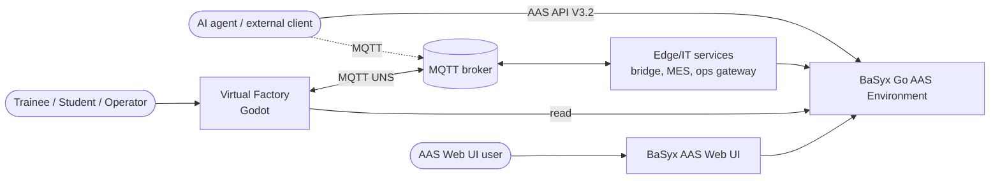

# Architecture (arc42)

> Living document. Sections marked *(planned)* are specified in [PLAN.md](../PLAN.md) and are moved here
> with implementation details as each milestone is completed.

## 1. Introduction and goals
See [requirements.md](../requirements.md). Top quality goals:
1. **Realism** of data flows and assets (NFR-07)
2. **Modularity and extensibility**, measured adherence ≥ 95 % (NFR-03/04)
3. **Performance** on slow hardware and XR-readiness (NFR-01/02)

## 2. Constraints
- Godot 4.7 (GDScript, Compatibility renderer), Blender 5.2 via MCP, Eclipse BaSyx Go 1.1.0 (AAS API V3.2), Python 3.12 + basyx-python-sdk.
- Local, single-machine deployment with docker compose. No authentication (local development only).
- Device models aligned with FMI 3.0 Co-Simulation (ADR-0002).

## 3. Context and scope

## 4. Solution strategy
| Goal | Approach |
|---|---|
| Realistic data flow | OT/IT split: devices + virtual PLC in Godot → MQTT UNS → edge services → AAS (ADR-0005) |
| Interchangeable devices | FMI-3-aligned model interface, one folder per device type, composition root (ADR-0002, ADR-0006) |
| Standards-based twins | IDTA submodel templates, AID/AIMC-driven bridge, AAS Operations for control |
| Slow hardware / XR | Mobile renderer, low-poly assets, baked lighting, PlayerRig abstraction (ADR-0001, ADR-0003) |
| Measurable architecture | `tools/arch_check.py`, gdlint, `tools/complexity_check.py` in CI |

## 5. Building block view
### Level 1: repository
| Block | Path | Responsibility |
|---|---|---|
| Godot simulation | `godot/` | 3D world, device models, virtual PLC, MQTT gateway, AAS inspector |
| Edge/IT services | `services/` | `vf_common` (shared: IDs, AAS template engine), `provisioner` (static AAS → AASX preload); databridge, mes, ops_gateway *(M4)* |
| AAS master data | `aas/` | Vendored IDTA templates + CDs, custom templates (YAML DSL), asset data, capability dictionary, documents (PDF) |
| 3D asset sources | `blender/` | .blend files and the generator scripts that produce them |
| Infrastructure | `infra/` | docker compose: BaSyx Go, AAS Web UI, Postgres, Mosquitto |
| Tooling | `tools/` | Architecture/complexity checks, test runners, screenshot helper |

### Level 2: Godot modules
Dependency rules: [dependency-rules.yaml](dependency-rules.yaml) (ADR-0006).

| Module | Responsibility | May depend on |
|---|---|---|
| `core` | FMI-3 API and co-sim master, PLC runtime and IEC FBs, PlayerRig/Interactable interfaces, utilities | — |
| `devices/<type>` | One device type each: model (FMU), probes, view, scene, type metadata | core |
| `products` | Workpiece scene, product-type resources | core |
| `control` | PLC programs (SortingLine), I/O maps | core |
| `connectivity` | MQTT gateway, UNS mapping, AAS REST reader | core (+ mqtt addon) |
| `world` | Hall, lighting, props | core |
| `player` | DesktopRig (later XRRig) | core |
| `ui` | World-space panels, AAS inspector, HMI, i18n | core |
| `scenarios` | Training scenarios, fault injection | core |
| `factory` | **Composition root**: layout loading, wiring, main scene | all |

## 6. Runtime view
- [Life cycle of one part](runtime-part-lifecycle.md) (OT layer, M1)
- Session start and agent operation: *(planned, M4)*, see [PLAN.md §3.9–3.10](../PLAN.md)

## 7. Deployment view
| Container | Image | Host port |
|---|---|---|
| aas-env | `eclipsebasyx/aasenvironment-go:1.1.0` | 8091 |
| aas-ui | `eclipsebasyx/aas-gui@sha256:5e9a…4298` | 3001 |
| db | `postgres:18` (tmpfs) | – |
| basyx-config | `eclipsebasyx/basyxconfigurationservice-go:1.1.0` (one-shot) | – |
| mqtt | `eclipse-mosquitto:2` | 1883, 9001 (ws) |
| provisioner | `vf-services:dev` (built from `services/Dockerfile`), one-shot before aas-env | – |
| databridge, mes, ops-gateway | `vf-services:dev` *(M4)* | 8095 (ops) |

The Godot application runs natively on the host and connects to `ws://localhost:9001` and `http://localhost:8091`.

## 8. Crosscutting concepts
- **ID scheme**: `services/vf_common/src/vf_common/ids.py` (base `https://virtual-factory.example/ids`).
- **Units**: SI throughout (m, s, rad, W, kWh, kg CO₂e). 1 Godot unit = 1 m. Godot is Y-up; the robot base frame is Z-up (converted in the robot view).
- **FMI-3 interface**: [interfaces/fmi-interface.md](../interfaces/fmi-interface.md), generated [device catalogue](../interfaces/device-catalog.md)
- **Device modules** (model / probe / view / root, services, teach points): [device-modules.md](device-modules.md)
- **Virtual PLC**: a PLC program is an FMI slave whose variables are the process image; IEC 61131-3 FBs
  (`core/plc/iec_*.gd`), PackML state machine, 10 ms scans ([ADR-0008](../adr/0008-plc-program-as-fmu.md))
- **3D asset pipeline** (Blender scripts → glb → ModelView, animations from recorded runs): [asset-pipeline.md](asset-pipeline.md)
- **Rendering/lighting**: Compatibility renderer, unbaked indoor lighting, draw-call budget ([ADR-0010](../adr/0010-compatibility-renderer-indoor-lighting.md))
- **Physics/transport**: belt `constant_linear_velocity` (Jolt), rigid workpieces, kinematic attach on grasp
  ([ADR-0009](../adr/0009-physical-transport-and-items.md))
- **AAS modelling**: [interfaces/aas-model.md](../interfaces/aas-model.md). Template-based generation
  ([ADR-0011](../adr/0011-template-based-aas-generation.md)), Control Components with PackML on the interface
  ([ADR-0012](../adr/0012-control-component-packml-on-interface.md)), interfaces generated from FMI
  ([ADR-0013](../adr/0013-aas-interfaces-generated-from-fmi.md))
- **UNS topics**: `godot/config/uns.yaml` (single source for the Godot gateway, AID generation and the data bridge)

## 9. Architecture decisions
See [adr/](../adr/README.md).

## 10. Quality requirements
See NFRs in [requirements.md](../requirements.md#3-non-functional-requirements).

## 11. Risks and technical debt
See [open-issues.md](../open-issues.md).

## 12. Glossary
| Term | Meaning |
|---|---|
| AAS | Asset Administration Shell (IEC 63278), the standardised digital twin |
| AID / AIMC | IDTA Asset Interfaces Description / Asset Interfaces Mapping Configuration submodels |
| FMU / FMI | Functional Mock-up Unit / Interface (Modelica Association standard for simulation models) |
| KLT | Kleinladungsträger, a standardised small load carrier (VDA 4500) |
| PackML | ISA-TR88.00.02 machine state model |
| PCF | Product Carbon Footprint (ISO 14067) |
| UNS | Unified Namespace: an MQTT topic tree that mirrors the ISA-95 hierarchy |
