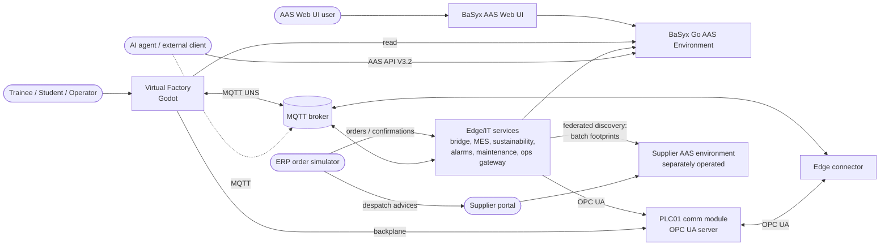

# Architecture (arc42)

> Living document. Sections marked *(planned)* are specified in [PLAN.md](../PLAN.md) and are moved here
> with implementation details as each milestone is completed.

## 1. Introduction and goals

See [requirements.md](../requirements.md). Top quality goals:

1. **Realism** of data flows and assets (NFR-07)
2. **Modularity and extensibility**, measured adherence ≥ 95 % (NFR-03/04)
3. **Performance** on slow hardware and XR-readiness (NFR-01/02)

## 2. Constraints

- Godot 4.7 (GDScript, Compatibility renderer), Blender 5.2 via MCP, Eclipse BaSyx Go 1.1.0 (AAS API V3.2), Python
  3.12 + basyx-python-sdk.
- Local, single-machine deployment with docker compose. No authentication (local development only).
- Device models aligned with FMI 3.0 Co-Simulation (ADR-0002).

## 3. Context and scope

## 4. Solution strategy

| Goal | Approach |
|---|---|
| Realistic data flow | OT/IT split: devices + virtual PLC in Godot → MQTT UNS → edge services → AAS (ADR-0005); the PLC exposes an OPC UA server (separate communication module) read by an edge connector, smart devices publish MQTT (ADR-0024) |
| Interchangeable devices | FMI-3-aligned model interface, one folder per device type, composition root (ADR-0002, ADR-0006) |
| Standards-based twins | IDTA submodel templates, AID/AIMC-driven bridge, AAS Operations for control |
| Slow hardware / XR | Mobile renderer, low-poly assets, baked lighting, PlayerRig abstraction (ADR-0001, ADR-0003) |
| Measurable architecture | `tools/arch_check.py`, gdlint, `tools/complexity_check.py` in CI |

## 5. Building block view

### Level 1: repository

| Block | Path | Responsibility |
|---|---|---|
| Godot simulation | `godot/` | 3D world, device models, virtual PLC (CPU; backplane link to its OPC UA module), MQTT gateway, AAS inspector |
| Edge/IT services | `services/` | `vf_common` (IDs, AAS template engine, discovery/registry resolver, BaSyx/MQTT clients, UNS registry), `provisioner` (static AAS → AASX preload), `bridge` (UNS → AAS via AIMC), `mes` (order execution, workpiece AAS and passports, quality, KLT, KPIs, BPMN workers), `sustainability` (product carbon footprint - owns the workpiece CarbonFootprint, supplier footprints, energy/CO₂e), `erp` (order simulator: orders, release, confirmations, batches), `alarms` (ISA-18.2 alarm management, UNS event journal, TimescaleDB), `maintenance` (predictive maintenance: health index and RUL from the historian, ConditionMonitoring, maintenance orders), `ops_gateway` (delegated AAS operations, configured from Control Component + AID; OPC UA or MQTT), `plc_comm` (OPC UA communication module of PLC01), `edge` (OPC UA → UNS connector), `resolver` (GS1 Digital Link resolver, passport page) – see [services.md](../interfaces/services.md) |
| BPMN models | `bpmn/` | WorkpieceLifecycle (procedure model of the master recipe; tasks of the MES and the sustainability service), ProductionOrder (released by the ERP, ADR-0016/0025), MaintenanceOrder (opened and executed by the maintenance service, ADR-0029) |
| AAS master data | `aas/` | Vendored IDTA templates + CDs, custom templates (YAML DSL), asset data, capability dictionary, documents (PDF) |
| 3D asset sources | `blender/` | .blend files and the generator scripts that produce them |
| Infrastructure | `infra/` | docker compose: BaSyx Go, AAS Web UI, Postgres, Mosquitto, Operaton, services |
| Tooling | `tools/` | Architecture/complexity checks, test runners, screenshot helper |

### Level 2: Godot modules

Dependency rules: [dependency-rules.yaml](dependency-rules.yaml) (ADR-0006).

| Module | Responsibility | May depend on |
|---|---|---|
| `core` | FMI-3 API and co-sim master, PLC runtime and IEC FBs, PlayerRig/Interactable interfaces, utilities (incl. QR encoder, GS1 Digital Link) | — |
| `devices/<type>` | One device type each: model (FMU), probes, view, scene, type metadata | core |
| `products` | Workpiece scene, product-type resources, type plate with the part's QR code | core |
| `control` | PLC programs (SortingLine), I/O maps | core |
| `connectivity` | MQTT 3.1.1 client (own GDScript, TCP/WebSocket), UNS gateway, PLC backplane link to the OPC UA communication module (ADR-0024), AAS client (discovery → registry → endpoint, ADR-0023) + BaSyx event feed, BPMN task client | core |
| `world` | Hall, lighting, props | core |
| `player` | DesktopRig (later XRRig) | core |
| `ui` | Views only (ADR-0018): world-space panels + pointer router, AAS inspector, HMI, MES task terminal, F1 menu, camera tour, data-flow view, theme, i18n | core |
| `scenarios` | Training scenarios, fault injection | core |
| `factory` | **Composition root**: layout loading, wiring, main scene, training-UI controllers (inspector, HMI, tasks, menu, data flow, asset picking, local commands) | all |

## 6. Runtime view

- [Life cycle of one part](runtime-part-lifecycle.md) (OT layer, M1)
- [OT/IT data flow, workpiece AAS and agent operation](runtime-ot-it.md) (M4)

## 7. Deployment view

| Container | Image | Host port |
|---|---|---|
| aas-env | `eclipsebasyx/aasenvironment-go:1.1.0` | 8091 |
| aas-ui | `eclipsebasyx/aas-gui@sha256:5e9a…4298` | 3001 |
| dpp-api | `eclipsebasyx/dppapi-go:1.1.0`, digital product passports read from the AAS database (ADR-0021) | 8093 |
| resolver | `vf-services:dev`, GS1 Digital Link resolver: redirect, linkset, passport page (ADR-0023) | 8096 |
| db | `postgres:18` (tmpfs) | – |
| basyx-config | `eclipsebasyx/basyxconfigurationservice-go:1.1.0` (one-shot) | – |
| mqtt | `eclipse-mosquitto:2` | 1883, 9001 (ws) |
| provisioner | `vf-services:dev` (built from `services/Dockerfile`), one-shot before aas-env | – |
| bridge, mes, ops-gateway, historian, edge | `vf-services:dev` | 8095 (ops-gateway, fixed IP 172.30.42.95 for the delegation allow-list) |
| plc-comm | `vf-services:dev`, communication module of PLC01: OPC UA server (asyncua, None/Anonymous) + backplane for the simulated CPU (ADR-0024) | 4840 (opc.tcp, `/vf/plc01`), 4841 (backplane, TCP) |
| sustainability | `vf-services:dev`, product carbon footprint (BPMN task `pcf-calculate`, CarbonFootprint submodel), energy/CO₂e, KPIs (ADR-0025) | 8097 |
| erp | `vf-services:dev`, ERP order simulator: orders released via BPMN message, confirmations, batches, status page; in memory (ADR-0025) | 8098 |
| alarms | `vf-services:dev`, ISA-18.2 alarm management + UNS event journal, REST API (ADR-0026) | 8099 |
| maintenance | `vf-services:dev`, predictive maintenance: health index / RUL from the historian, UNS results, ConditionMonitoring, MaintenanceOrder worker, ERP maintenance windows (ADR-0029) | 8094 |
| alarms-db | `timescale/timescaledb:2.30.2-pg17` (tmpfs), database of the alarms service, read by Grafana (role `grafana`) | – |
| influxdb3 | `influxdb:3.12.0-core` (historian time-series DB, tmpfs, no auth, ADR-0019) | 8181 (HTTP: write_lp, query_sql) |
| grafana | `grafana/grafana:13.2.3`, dashboards on the historian (SQL via Flight SQL), and the alarms database (dashboard "Alarms & events", ADR-0026), provisioned from `infra/grafana/`, anonymous read-only, login to edit, volume `vf_grafana-data` (ADR-0022) | 3002 |
| bpmn | `operaton/operaton:2.1.5` (in-memory H2) | 8092 (REST, Cockpit, Tasklist) |
| supplier-aas-env | `eclipsebasyx/aasenvironment-go:1.1.0`, **second, separately operated AAS environment** of the suppliers: company AAS, supplier product types, batch AAS; own `supplier-db` (`postgres:18`, tmpfs), `supplier-config` and one-shot `supplier-provisioner` (`provisioner build --data supplier` → `infra/basyx/preload-supplier`); no eventing (ADR-0028) | 8191 |
| supplier | `vf-services:dev`, supplier portal: despatch advices per lot, publishes the batch AAS in the supplier environment (ADR-0028) | 8190 |
| keycloak (secure profile only) | `keycloak/keycloak:26.7.4` (dev mode), realm `virtual-factory` imported from `infra/keycloak/` (generated from `infra/security.yaml`); issuer `http://localhost:8180/realms/virtual-factory` (ADR-0027) | 8180 |
| bpmn-users (secure profile only) | `curlimages/curl:8.17.0`, one-shot: Operaton engine users per service | – |
| nodered (optional, profile `sandbox`) | `nodered/node-red:4.1.15-22`, learner sandbox outside the core data path; flows from `infra/nodered/`, edits in volume `vf_nodered-data`, no auth | 1880 |

**Secure profile** ([ADR-0027](../adr/0027-optional-security-profile-keycloak-abac.md), [security.md](security.md)):
`docker compose -f infra/docker-compose.yml -f infra/docker-compose.secure.yml up -d` keeps every container and
port but adds Keycloak and switches aas-env, dpp-api and supplier-aas-env to ABAC (`infra/basyx/security`), the
broker to accounts + ACLs (`infra/mosquitto/secure`), plc-comm to Basic256Sha256 SignAndEncrypt with user names,
the services to client-credential tokens and token-checked APIs, Operaton, Grafana, Node-RED and the AAS web UI to
logins. Godot joins with `--vf-secure`.

Desktop builds (macOS universal, Windows/Linux x86_64) come from `tools/export_builds.sh`
(`godot/export_presets.cfg`). The Godot application runs natively on the host and connects to `ws://localhost:9001`,
`http://localhost:8091` (and, for supplier batch AAS opened from a BoM, `http://localhost:8191` - `aas_registries`)
and (PLC01 CPU → communication module) `tcp://localhost:4841`. Federation in compose: the sustainability service
lists both environments in `VF_AAS_REGISTRIES` and maps their public descriptor URLs (`localhost:8091/8191`) to
the compose hosts (`aas-env`, `supplier-aas-env`) with `VF_AAS_ENDPOINT_MAP`.

## 8. Crosscutting concepts

- **ID scheme**: `services/vf_common/src/vf_common/ids.py` (base `https://virtual-factory.example/ids`) - how ids
  are minted; products are identified by GS1 Digital Links (ADR-0021).
- **Identification and resolution** ([ADR-0023](../adr/0023-discovery-registry-resolution-and-gs1-resolver.md)):
  clients resolve asset id → discovery → AAS id → registry → endpoint (`vf_common.resolver`, Godot `AasClient`)
  over a configurable list of environments (federation), with caching and BaSyx-event invalidation. The QR code on
  each part encodes its Digital Link; the GS1 resolver (`services/resolver`) serves passport page and linkset.
- **Supplier data exchange** ([ADR-0028](../adr/0028-supplier-environment-batch-aas-federated-footprints.md)):
  suppliers publish company, product type and batch AAS in their own environment (own id namespaces, `idBase`);
  purchased batches are SelfManaged BoM nodes identified by the batch Digital Link (`/01/<GTIN>/10/<lot>`); the
  PCF reads batch footprints through federated discovery and records the data quality (primary/secondary).
- **Units**: SI throughout (m, s, rad, W, kWh, kg CO₂e). 1 Godot unit = 1 m. Godot is Y-up; the robot base frame is Z-up
  (converted in the robot view).
- **FMI-3 interface**: [interfaces/fmi-interface.md](../interfaces/fmi-interface.md), generated [device catalogue](../interfaces/device-catalog.md)
- **Device modules** (model / probe / view / root, services, teach points): [device-modules.md](device-modules.md)
- **Virtual PLC**: a PLC program is an FMI slave whose variables are the process image; IEC 61131-3 FBs
  (`core/plc/iec_*.gd`), PackML state machine, 10 ms scans ([ADR-0008](../adr/0008-plc-program-as-fmu.md))
- **Fault injection / training**: faults are FMI inputs/tunable parameters, PLC alarms with PackML reactions,
  data-driven scenarios (`godot/scenarios`, `godot/config/scenarios`): [interfaces/scenarios.md](../interfaces/scenarios.md)
- **3D asset pipeline** (Blender scripts → glb → ModelView, animations from recorded runs): [asset-pipeline.md](asset-pipeline.md)
- **Rendering/lighting**: Compatibility renderer, unbaked indoor lighting, draw-call budget ([ADR-0010](../adr/0010-compatibility-renderer-indoor-lighting.md))
- **Physics/transport**: belt `constant_linear_velocity` (Jolt), rigid workpieces, kinematic attach on grasp
  ([ADR-0009](../adr/0009-physical-transport-and-items.md))
- **AAS modelling**: [interfaces/aas-model.md](../interfaces/aas-model.md). Template-based generation
  ([ADR-0011](../adr/0011-template-based-aas-generation.md)), Control Components with PackML on the interface
  ([ADR-0012](../adr/0012-control-component-packml-on-interface.md)), interfaces generated from FMI
  ([ADR-0013](../adr/0013-aas-interfaces-generated-from-fmi.md))
- **UNS topics**: `godot/config/uns.json` (single source for the Godot gateway and the AID generation; the edge
  services read the topics from the AAS), [interfaces/uns.md](../interfaces/uns.md),
  [ADR-0014](../adr/0014-godot-uns-gateway.md)
- **AAS-driven integration**: AIMC bridge ([ADR-0015](../adr/0015-aimc-bridge.md)), BaSyx MQTT eventing for
  reloads, line commands as delegated AAS operations ([ADR-0017](../adr/0017-aas-operations-delegated.md)); the
  ops gateway resolves its endpoints via Control Component → AID, skills are executable, the MES discovers its
  event topics from the AID ([ADR-0020](../adr/0020-control-component-and-aid-drive-commands.md))
- **Orchestration**: BPMN on MES level, PLC keeps real-time control ([ADR-0016](../adr/0016-bpmn-orchestration.md));
  services take part through external tasks (MES, sustainability), the ERP releases orders by message
  ([ADR-0025](../adr/0025-service-decomposition-sustainability-erp.md))
- **Service decomposition and data ownership** ([ADR-0025](../adr/0025-service-decomposition-sustainability-erp.md)):
  MES - workpiece AAS and passport composition, quality, KLT contents, ISO 22400 KPIs; sustainability -
  CarbonFootprint of every workpiece and the EnergyConsumption values; ERP - orders and batch records; alarms -
  alarm states, alarm and event journal ([ADR-0026](../adr/0026-alarm-management-isa-18-2-timescaledb.md));
  maintenance - ConditionMonitoring and the observed Reliability data of monitored components, maintenance orders
  ([ADR-0029](../adr/0029-predictive-maintenance-condition-monitoring.md)).
  Passports of shipped units outlive the session (retention policy in LINE01), serial numbers are retentive.
- **Predictive maintenance** ([ADR-0029](../adr/0029-predictive-maintenance-condition-monitoring.md)): wear is
  part of the device FMU (gripper fingers of RB01, smart-gripper diagnostics as outputs, failure only beyond a
  threshold); the maintenance service fits the wear trend from the historian (RUL with a lower bound, design
  rate from Reliability as fallback), opens a BPMN MaintenanceOrder, the ERP keeps the line free at the next
  order boundary, the line is taken into maintenance and the part change is confirmed only through LineControl /
  Control Component (skill `Maintain`, `SetUnitMode`).
- **Security** ([ADR-0027](../adr/0027-optional-security-profile-keycloak-abac.md), [security.md](security.md)):
  open by default for training; an optional secure profile adds OIDC identities (Keycloak realm, one client per
  service, roles per person), BaSyx Go ABAC with write ownership per service and passport sections per role,
  broker ACLs, OPC UA SignAndEncrypt + user tokens and logins for all UIs - generated from one model
  (`infra/security.yaml`); the AID describes the endpoint security of the running profile.
- **OT protocols**: PLC01 on OPC UA (communication module `plc-comm` fed over a backplane link, PackML structure
  after OPC 30050, edge connector OPC UA → UNS, AID with an OPC UA interface, ops gateway calls methods); robot,
  assembly cell, KLT stations, stack light and the field devices' twins publish MQTT directly
  ([ADR-0024](../adr/0024-plc-opc-ua-server-and-edge-connector.md))

## 9. Architecture decisions

See [adr/](../adr/README.md).

## 10. Quality requirements

See NFRs in [requirements.md](../requirements.md#3-non-functional-requirements).
Visual presets, budgets and measurements: [visual-quality.md](visual-quality.md).

## 11. Risks and technical debt

See [open-issues.md](../open-issues.md).

## 12. Glossary

| Term | Meaning |
|---|---|
| AAS | Asset Administration Shell (IEC 63278), the standardised digital twin |
| AID / AIMC | IDTA Asset Interfaces Description / Asset Interfaces Mapping Configuration submodels |
| Backplane | Link between the PLC CPU (simulated in Godot) and its communication module (plc-comm), JSON over TCP |
| OPC UA | IEC 62541 client/server protocol of industrial automation; OPC 30050 = PackML companion specification |
| FMU / FMI | Functional Mock-up Unit / Interface (Modelica Association standard for simulation models) |
| KLT | Kleinladungsträger, a standardised small load carrier (VDA 4500) |
| PackML | ISA-TR88.00.02 machine state model |
| PCF | Product Carbon Footprint (ISO 14067) |
| UNS | Unified Namespace: an MQTT topic tree that mirrors the ISA-95 hierarchy |
