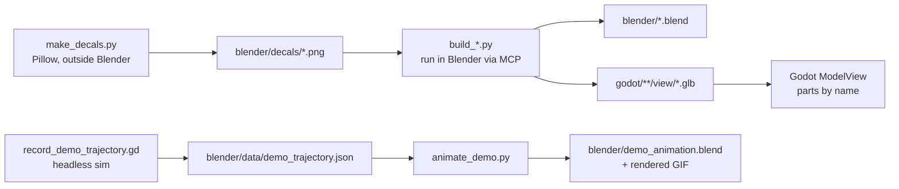

# Concept: 3D asset pipeline (Blender → Godot)

- **Reproducible:** every asset is generated by a script (`blender/scripts/build_<asset>.py`).
  `build_all.py` rebuilds everything:
  `exec(open("<repo>/blender/scripts/build_all.py").read())` via the Blender MCP or the Blender Python console.
  The `.blend` files are saved copies for inspection and manual tweaks. The scripts remain the source of truth.
- **Shared library** `vf_lib.py`:
  - sRGB palette → linear Principled BSDF materials
  - bevelled boxes and cylinders, aluminium slot profiles (`slot_profile`, `slot_profile_rect`)
  - UV planes and decals, join with origin, glTF export, review renders
- **Conventions:**
  - Metres, Blender Z up; the exporter converts to Godot Y up: (x, y, z) → (x, z, −y).
  - Front/operator side = Blender −Y = Godot +Z.
  - Parts that a view animates or switches are **separate named objects**, e.g. `J1..J6`, `FingerA`, `DriveDrum`,
    `LedSignal`, `LightGreen`, `RingLight`, `LabelA/B`, `Cap`.
  - Everything else is joined per logical part (fewer nodes and draw calls).
  - The UR5e joints lie exactly on the DH frames of `ur_kinematics.gd`: `J<i>` rotates about Blender local Z (Godot
    local Y), so `J<i>.basis = Basis(UP, q_i)` and a Blender keyframe `J<i>.rotation_euler.z = q_i` are the same motion.
- **Detail level:** recognisable real products, shown by geometry (profiles, fittings, motors, connectors, LEDs)
  plus simple decals (type plates, warning signs, labels, HMI screens). No other textures. No real-company logos.
- **Budgets (triangles):**

  | Asset | Triangles |
  |---|---|
  | Product | 0.9 k |
  | Conveyor parts | 2.8 k |
  | Light barrier | 0.6 k |
  | QA station | 0.8 k |
  | KLT | 1.0 k |
  | Assembly cell | 2.3 k |
  | UR5e | 4.2 k |
  | Hall | 6.6 k |
  | Props | 1.0 k |
  | **Total** | **≈ 20 k** |

- **Collision** is never taken from the visual models: views add simple box shapes in code (belt, guides, KLT walls,
  hall), so visuals can change without affecting physics.
- **Animations:**
  - At runtime all motion is driven by the simulation (FMU outputs → views).
  - Blender animations are generated from recorded simulation data (`tests/tools/record_demo_trajectory.gd` →
    `animate_demo.py`), so the Blender clip shows exactly the simulated motion: belt, drums, product, robot joints,
    gripper.
