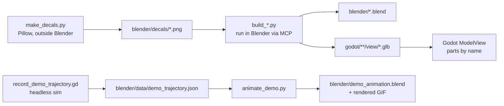

# Concept: 3D asset pipeline (Blender → Godot)

- **Reproducible:** every asset is generated by a script (`blender/scripts/build_<asset>.py`).
  `build_all.py` rebuilds everything:
  `exec(open("<repo>/blender/scripts/build_all.py").read())` via the Blender MCP or the Blender Python console.
  The `.blend` files are saved copies for inspection and manual tweaks. The scripts remain the source of truth.
- **Shared library** `vf_lib.py`:
  - sRGB palette → linear Principled BSDF materials
  - bevelled boxes and cylinders, aluminium slot profiles (`slot_profile`, `slot_profile_rect`)
  - UV planes and decals, join with origin, glTF export, AgX studio review renders
- **Finish helpers:** `vf_finish.py` bakes local crevice shading into vertex colours and batches opaque
  paint/metal/rubber surfaces. `vf_surfaces.py` makes seeded, seamless 512 px floor maps and planar UVs.
  `vf_details.py` builds service details/signs; `vf_grounding.py` adds 64 px equipment contact cards.
  Godot `core/util/asset_post_import.gd` attaches the shared finish shader and disables tiny-detail shadows.
  The shader converts linear glTF vertex colours for Compatibility; labels and switchable materials stay separate.
- **Conventions:**
  - Metres, Blender Z up; the exporter converts to Godot Y up: (x, y, z) → (x, z, −y).
  - Front/operator side = Blender −Y = Godot +Z.
  - Parts that a view animates or switches are **separate named objects**, e.g. `J1..J6`, `FingerA`, `DriveDrum`,
    `LedSignal`, `LightGreen`, `RingLight`, `LabelA/B`, `Cap`.
  - Everything else is joined per logical part (fewer nodes and draw calls).
  - The UR5e joints lie exactly on the DH frames of `ur_kinematics.gd`: `J<i>` rotates about Blender local Z (Godot
    local Y), so `J<i>.basis = Basis(UP, q_i)` and a Blender keyframe `J<i>.rotation_euler.z = q_i` are the same motion.
- **Detail level:** recognisable products with bevels, smooth cylinders, profiles, fittings, panels, vents,
  service cables and welded-wire fencing. Textured concrete/epoxy floors, expansion joints, structural
  footplates and bay signs make the hall less uniform. No real-company logos.
- **Exported geometry** (2026-10-04; `uv run tools/inspect_visual_assets.py`):

  | Asset | Triangles | Material surfaces |
  |---|---:|---:|
  | Cylinder | 942 | 4 |
  | Conveyor parts | 2,802 | 18 |
  | Light barrier | 560 | 7 |
  | QA station | 776 | 8 |
  | KLT | 990 | 6 |
  | Assembly cell | 2,698 | 14 |
  | UR5e | 4,244 | 17 |
  | Stack light | 956 | 4 |
  | Hall | 8,578 | 16 |
  | Cabinet | 410 | 5 |
  | HMI stand | 324 | 5 |
  | Fence / door | 2,350 | 5 |
  | **Total** | **25,630** | **109** |

  These count mesh definitions, not runtime instances, imported LODs or shadow passes. The twelve GLBs
  occupy **3.80 MiB** on disk; this is not their GPU memory usage. Runtime budgets and quality options are
  in [visual-quality.md](visual-quality.md). Small details are batched by finish instead of each gaining
  another draw call. Fine fence-wire meshes are separate so Low can hide them.
- **Derived artifacts:** build scripts refresh `blender/*.blend`, Godot GLBs and
  `docs/screenshots/assets/*.png`. Models3D entries are version 1.1 dated 2026-10-04; rebuild AASX packages
  to embed the new models/previews. LINE01 uses `factory-line.png`. See the
  [screenshot inventory](../screenshots/README.md) for live attachment refresh and historical captures.

- **Collision** is never taken from the visual models: views add simple box shapes in code (belt, guides, KLT walls,
  hall), so visuals can change without affecting physics.
- **Animations:**
  - At runtime all motion is driven by the simulation (FMU outputs → views).
  - Blender animations are generated from recorded simulation data (`tests/tools/record_demo_trajectory.gd` →
    `animate_demo.py`), so the Blender clip shows exactly the simulated motion: belt, drums, product, robot joints,
    gripper.
