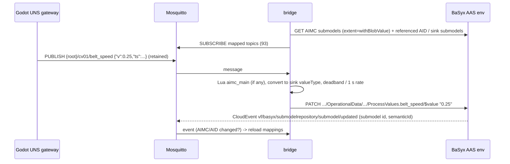

# Runtime view: OT/IT data flow (M4)

Measured on the development machine with the complete stack (`docker compose -f infra/docker-compose.yml up -d`)
and Godot in real time (`--vf-uns=ws://localhost:9001`). Services: [interfaces/services.md](../interfaces/services.md),
UNS: [interfaces/uns.md](../interfaces/uns.md).

## 1. Telemetry into the AAS (AIMC-driven)



About 175 UNS messages/s in real time; the bridge writes ~15 values/s (102 mappings).

## 2. Life cycle of one workpiece (UNS events → BPMN → AAS)

```mermaid
sequenceDiagram
  participant G as Godot (AC01, PLC01)
  participant M as MES (events)
  participant E as Operaton
  participant W as MES worker
  participant A as BaSyx
  G->>M: event part_released {serial, leak_rate, stroke_time}
  M->>E: correlate PartReleased (businessKey = serial) -> new WorkpieceLifecycle
  E->>W: external task workpiece-create
  W->>A: PUT shell + Nameplate, DppMetadata, ExecutedProcesses (OP10-OP70), AssetLocation
  G->>M: event part_inspected {serial, result, r,g,b, delta_e}   (≈ 11 s later)
  M->>E: correlate PartInspected (retried until the instance waits)
  E->>W: workpiece-record-inspection
  W->>A: PUT ExecutedProcesses (+OP75, OP80), QualityInspection, MeasurementValue x2
  G->>M: event part_sorted {serial, container, slot}             (≈ 8 s later)
  M->>E: correlate PartSorted
  E->>W: workpiece-record-packing
  W->>A: PUT ExecutedProcesses (+OP90, Completed), CarbonFootprint, AssetLocation; KLT contents
  E->>E: gateway correctContainer? -> end / user task "Check mis-sorted part"
```

Measured: every part of a 4-minute run ended in `End_Completed`, no incidents; a workpiece AAS has 8 submodels
when packed. The instance PCF is ≈ 3.905 kg CO₂e (BoM components 3.9004 + line energy ≈ 4 Wh × 0.363 kg/kWh).

## 3. Agent / workflow operation through the AAS

```mermaid
sequenceDiagram
  participant C as Client (BPMN worker, agent, curl)
  participant A as BaSyx AAS env
  participant O as ops-gateway
  participant M as Mosquitto
  participant G as Godot PLC01
  C->>A: POST LINE01/LineControl/ExecutePackMLCommand/invoke {Command: Hold}
  A->>O: POST /operations/ExecutePackMLCommand [OperationVariables]  (invocationDelegation)
  O->>O: PackML check (Hold allowed in EXECUTE?)
  O->>M: {root}/plc01/cmd/packml_command {"v":4,"corr":...}
  M->>G: command (applied before the next step, pulse)
  G->>M: cmd-resp {"corr":...,"accepted":true}; packml_state 11 (HELD)
  M->>O: ack, state
  O-->>A: [Accepted=true, State=HELD, Message]
  A-->>C: outputArguments
```

Round trip < 50 ms. A disallowed command (e.g. Start in EXECUTE) returns `Accepted=false` with the allowed commands
and is not sent to the PLC.

## 4. Production order with operator tasks

`ProductionOrder` (bpmn/production_order.bpmn): `line-start` switches off the automatic KLT exchange (if the order
asks for manual exchange) and starts the line through LineControl; every 10 s `order-progress` reads the counters
from PLC01/OperationalData. When a KLT is full the PLC suspends the line and publishes `container_full`; the MES
correlates `ContainerFull`, the event sub-process creates the user task *Exchange KLT*; completing it in Tasklist
invokes `ExchangeContainer`, the PLC exchanges the KLT and resumes. When the quantity is reached the line is stopped
and automatic exchange restored. A reject rate above the limit holds the line and creates *Investigate reject rate*.

Verified run (order of 14 good parts, manual exchange): started 14:00:48, KLT A full → operator task → exchange →
line resumed, order closed 14:04:46 with 14 good parts, line STOPPED, auto exchange restored.
