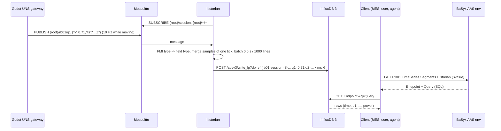
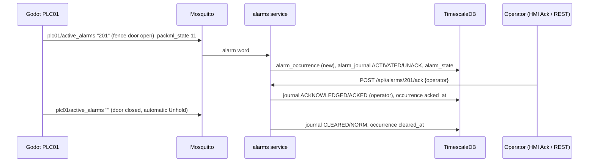
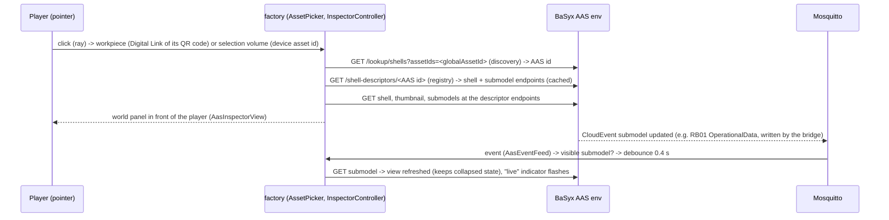
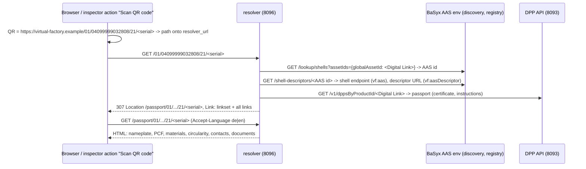

# Runtime view: OT/IT data flow (M4)

Measured on the development machine with the complete stack (`docker compose -f infra/docker-compose.yml up -d`)
and Godot in real time (`--vf-uns=ws://localhost:9001`). Services: [interfaces/services.md](../interfaces/services.md),
UNS: [interfaces/uns.md](../interfaces/uns.md).

## 1. Telemetry into the AAS (AIMC-driven)

```mermaid
sequenceDiagram
  participant G as Godot UNS gateway
  participant M as Mosquitto
  participant B as bridge
  participant A as BaSyx AAS env
  B->>A: GET /submodel-descriptors (registry) -> AIMC endpoints; GET AIMC (withBlobValue), AID / sinks via registry
  B->>M: SUBSCRIBE mapped topics (94)
  G->>M: PUBLISH {root}/cv01/running {"v":true,"ts":...} (retained)
  M->>B: message
  B->>B: Lua aimc_main (if any), convert to sink valueType, deadband / 5 s rate for numbers
  B->>A: PATCH .../OperationalData/.../ProcessValues.running/$value "true"
  A-->>M: CloudEvent vf/basyx/submodelrepository/submodel/updated (submodel id, semanticId)
  M->>B: event (AIMC/AID changed?) -> reload mappings
```

Only state and slow values reach the AAS (ADR-0019): 104 mappings (discrete outputs, OperatingState/Hours,
EnergyConsumption). Measured with a 240 s real-time run (incl. a 45 s hold): about 175 UNS telemetry messages/s,
the bridge writes 8.2 values/s (replaying the same traffic through the old policy - every output, numbers ≤ 1/s -
gives 19.4/s, the new policy 6.9/s); the MES no longer PUTs time-series segments.

## 1a. Telemetry into the historian (ADR-0019)



The historian stores ~210 samples/s as ~90 rows/s in 2 batched write requests/s (0.5 s batches); the TimeSeries
submodel is static, so recording causes no AAS traffic. The sustainability service reads the series of a part
(cell cycle, release → sort) with ~20 small SQL queries when the part is packed.
Grafana (ADR-0022, port 3002) queries the same tables over Flight SQL (gRPC on port 8181): about 35 SQL
queries per refresh of *LINE01 live* (every 5 s per open browser), each limited to the time range.

## 2. Life cycle of one workpiece (UNS events → BPMN → AAS)

```mermaid
sequenceDiagram
  participant G as Godot (AC01, PLC01)
  participant M as MES (events)
  participant E as Operaton
  participant W as MES worker
  participant S as Sustainability worker
  participant A as BaSyx
  G->>M: event part_released {serial, leak_rate, stroke_time, lots}
  M->>E: correlate PartReleased (businessKey = serial) -> new WorkpieceLifecycle
  E->>W: external task workpiece-create
  W->>A: PUT shell + Nameplate, DppMetadata, ExecutedProcesses (OP10-OP70), AssetLocation,
  W->>A: ContactInformations, HierarchicalStructures (batches), MaterialComposition, Circularity
  G->>M: event part_inspected {serial, result, r,g,b, delta_e}   (≈ 11 s later)
  M->>E: correlate PartInspected (retried until the instance waits)
  E->>W: workpiece-record-inspection
  W->>A: PUT ExecutedProcesses (+OP75, OP80), QualityInspection, MeasurementValue x2, TechnicalData
  G->>M: event part_sorted {serial, container, slot}             (≈ 8 s later)
  M->>E: correlate PartSorted
  E->>W: workpiece-record-packing
  W->>A: PUT ExecutedProcesses (+OP90, Completed), HandoverDocumentation, AssetLocation, DppMetadata (Active)
  W->>A: PUT attachments (certificate PDF, type documents); KLT contents
  E->>S: external task pcf-calculate
  S->>S: historian energy (SQL), supplier footprints per batch, loss allocation
  S->>A: PUT CarbonFootprint submodel, POST submodel-ref to the workpiece shell
  E->>E: gateway correctContainer? -> end / user task "Check mis-sorted part"
```

Measured: every part of a 4-minute run ended in `End_Completed`, no incidents; a workpiece AAS has 14 submodels
when packed (item-level passport, ADR-0021; readable via the DPP API on port 8093), 13 written by the MES and the
CarbonFootprint by the sustainability service (ADR-0025). The instance PCF is production-based (aas-model.md §6a).
Verification run (240 s real time,
AC01 missing-cap rate 0.25 → 7 of 14 packed parts rejected, line held 45 s via LineControl): a normally produced
part gets 4.7 Wh electricity + 0.6 Wh compressed air → 0.0019 kg CO₂e (A3 without losses); the part that waited
on the held line (residence 69 s instead of ~24 s) 6.1 Wh (+29 %), the part assembled during the hold (cell cycle
incl. 45 s idle) 8.5 Wh (+80 %). Rejects report 3.902 kg (components 3.9004 + energy); good parts carry the
session's losses per good part (3.90 kg at the end of the run, 11.7 kg for the first good part after three
rejects), so A1-A3 of good parts is 7.80–15.61 kg.

## 3. Agent / workflow operation through the AAS

```mermaid
sequenceDiagram
  participant C as Client (BPMN worker, agent, curl)
  participant A as BaSyx AAS env
  participant O as ops-gateway
  participant P as plc-comm (OPC UA server)
  participant G as Godot PLC01 (CPU)
  Note over O,A: start-up and on BaSyx change events of the configuration submodels
  O->>A: GET LINE01/LineControl → ControlComponent → PLC01/ControlComponentInstance
  O->>A: GET PLC01/AssetInterfacesDescription (EndpointReference targets in InterfaceOPCUA)
  O->>P: monitored items Status.StateCurrent, Status.UnitModeCurrent (publishing 50 ms)
  C->>A: POST LINE01/LineControl/ExecutePackMLCommand/invoke {Command: Hold}
  A->>O: POST /operations/ExecutePackMLCommand [OperationVariables]  (invocationDelegation)
  O->>O: PackML check (Hold allowed in EXECUTE?)
  O->>P: Call PLC01.Commands.packml_command(Value=4)
  P->>G: backplane write {variable: packml_command, v: 4}
  G->>G: applied before the next step (pulse), PLC scan → HELD
  G-->>P: result {accepted: true}; image {packml_state: 11}
  P-->>O: Call result Good; data change StateCurrent = 11
  O-->>A: [Accepted=true, State=HELD, Message]
  A-->>C: outputArguments
```

PLC01's endpoints are OPC UA affordances since ADR-0024 (see 3a for the measured times); for a controller whose
Control Component points to an MQTT interface the gateway publishes on the AID command topic and waits for the ack
(`forms`, `input`, `ackForms`, `output`, ADR-0020) - the robot keeps that path. A disallowed command (e.g. Start in
EXECUTE) returns `Accepted=false` with the allowed commands and is not sent to the PLC. Editing an href in BaSyx
re-routes the next command. `ExecuteSkill(Produce)` runs the same path for each PackML command needed to reach
EXECUTE (e.g. Reset → Start), after validating skill, mode and parameters against the Control Component Instance
and applying the unit mode (`UnitModeCommand`, only in STOPPED/IDLE/ABORTED).

## 3a. PLC01 on OPC UA: backplane, server, edge (ADR-0024)

```mermaid
sequenceDiagram
  participant G as Godot PLC01 (CPU)
  participant P as plc-comm
  participant E as edge
  participant M as Mosquitto
  participant X as UNS consumers (historian, MES, bridge, alarms)
  G->>P: TCP 4841 hello → welcome; image (all PLC variables)
  E->>P: subscription: 33 monitored items + PartInspected/PartSorted events on PLC01
  loop every physics tick with changes
    G->>P: image {ts, changed values}; event {part_sorted, payload}
    P->>P: write nodes (SourceTimestamp = simulation time); trigger OPC UA event
  end
  P-->>E: publish response every 100 ms (data changes, events)
  E->>M: {root}/plc01/<variable> {"v","ts"} (retained); {root}/plc01/event/part_sorted
  M->>X: unchanged topics and payloads
  X->>M: {root}/plc01/cmd/klt_exchange_command (e.g. Node-RED)
  M->>E: command
  E->>P: Call PLC01.Commands.klt_exchange_command(1)
  P->>G: backplane write → result
  E->>M: cmd-resp {"corr","accepted","reason","v","ts"}
```

Measured (M9, full stack + headless Godot in real time, PLC01 linked):

| Path | OPC UA path (ADR-0024) | direct MQTT (`--vf-backplane=off`) |
|---|---|---|
| LineControl `ExecutePackMLCommand(Hold)` via BaSyx → ops gateway → OPC UA call → PLC → state HELD observed | 43–49 ms | (not available: CC points to OPC UA) |
| UNS command `cmd/packml_command` → ack on `cmd-resp` (median / p90, n = 20) | 21 / 44 ms (edge → OPC UA call) | 9 / 20 ms |
| UNS command → new `packml_state` on the UNS (median / p90) | 95 / 115 ms | 12 / 23 ms |
| PLC01 event on the UNS relative to its simulation timestamp | ≈ +70 ms later than the direct events | - |
| OPC UA method call incl. backplane round trip (plc-comm log) | 9–17 ms mean | - |

- The extra time is the OPC UA publishing interval (100 ms for the edge, 50 ms for the ops gateway) plus one
  physics tick on the backplane; commands are synchronous and fast. All values keep the simulation-time timestamp
  of the CPU (SourceTimestamp), so historian and MES see the same `ts` as before.
- Load: ~1.2 backplane image messages/s (only ticks with changed PLC values), 2–3 PLC01 telemetry messages/s
  and ~9 events/min on the UNS (direct path: 1.9 messages/s in a comparable window); plc-comm ≈ 1 % CPU / 127 MiB,
  edge ≈ 1 % / 75 MiB. The BPMN order flow (SetAutoExchange, Clear/Reset/Start) uses the OPC UA path as well
  (4–25 method calls/min while orders start and end).
- `ExecuteSkill(Produce, Maintenance)` from EXECUTE is rejected at once ("stop the line first"); after Stop it
  switches the unit mode over OPC UA and runs Reset → Start (2.2 s, incl. 2 s waiting for an auto start that
  does not happen in Maintenance).

## 4. Production order with operator tasks

```mermaid
sequenceDiagram
  participant R as ERP (8098)
  participant E as Operaton
  participant M as MES worker
  participant A as BaSyx / LINE01
  R->>E: message OrderReleased (businessKey PO-2026-0002, quantity, material, dueDate)
  E->>M: line-start
  M->>A: LineControl SetAutoExchange, Reset/Start
  M->>R: OperationsPerformance InProcess (0/0)
  loop every 10 s
    E->>M: order-progress
    M->>A: read PLC01/OperationalData counters
    M->>R: OperationsPerformance InProcess (good, scrap) if changed
  end
  E->>M: line-command Stop, order-close
  E->>M: order-confirm
  M->>R: OperationsPerformance Completed + MaterialConsumedActual (article, lot, qty)
  R->>R: book consumption to batches; release the next order (standing order policy)
```

`ProductionOrder` (bpmn/production_order.bpmn) is started by the ERP's message `OrderReleased` (or manually from
Tasklist): `line-start` switches off the automatic KLT exchange (if the order
asks for manual exchange) and starts the line through LineControl; every 10 s `order-progress` reads the counters
from PLC01/OperationalData. When a KLT is full the PLC suspends the line and publishes `container_full`; the MES
correlates `ContainerFull`, the event sub-process creates the user task *Exchange KLT*; completing it in Tasklist
invokes `ExchangeContainer`, the PLC exchanges the KLT and resumes. When the quantity is reached the line is stopped
and automatic exchange restored. A reject rate above the limit holds the line and creates *Investigate reject rate*.

Verified run (order of 14 good parts, manual exchange): started 14:00:48, KLT A full → operator task → exchange →
line resumed, order closed 14:04:46 with 14 good parts, line STOPPED, auto exchange restored.

Verified with the ERP (2026-10-03, standing order of 6 parts): PO-2026-0002 released 19:00:16, InProcess with the
first confirmation, Completed 19:02:03 with 6 good / 1 scrap, 7 confirmations and the consumption of 9 lots
(e.g. 9 × barrel L2609-0418, 72 screws NRN-26-33870), next standing order released within 5 s and the line
restarted. An order spanning a new Godot session kept its progress (counters rebased). After an ERP restart the
running order was adopted (`Adopted`, numbering continued).

## 4a. Alarm life cycle (ISA-18.2, ADR-0026)



Every UNS event, command, command acknowledgement, PackML state change and session birth is written to
`event_journal` as well. Verified (2026-10-03): protective stop injected via `rb01/cmd/protective_stop` →
201 UNACK (Medium) after < 1 s, acknowledged by "A3-test" 6 s later, NORM 0.1 s after the release; occurrence
row with activated/acked/cleared times; Grafana "Alarms & events" shows the occurrence in all panels. An E-stop
while the door is open records 201 as DSUPR (not annunciated) until the E-stop is released (unit and database
tests).

## 4b. Predictive maintenance order (ADR-0029)

```mermaid
sequenceDiagram
  participant G as Godot RB01 (gripper wear)
  participant H as historian / InfluxDB
  participant S as maintenance service (8094)
  participant E as Operaton
  participant T as MES terminal / Tasklist
  participant R as ERP (8098)
  participant A as BaSyx / LINE01 LineControl
  participant O as ops gateway
  G->>H: UNS rb01/finger_wear, grip_cycles, grip_force ... (one row per grip)
  loop every 10 s
    S->>H: SQL history since the last finger change
    S->>S: HI, linear trend, RUL + 90 % lower bound, hours at throughput
    S->>A: ConditionMonitoring (changed values); UNS maintenance/gr01/* -> historian
  end
  S->>E: start MaintenanceOrder MO-2026-0001 (RUL lower bound < 8 h, HI < 0.85)
  S->>S: alarm word maintenance/active_alarms "901" -> alarms service
  T->>E: complete "Plan maintenance" (immediate = false)
  E->>S: maintenance-reserve
  S->>R: POST /api/maintenance-windows (OrderBoundary): no further order release
  loop every 5 s until the window is active
    E->>S: maintenance-check-line
    S->>R: GET window (Active after the MES confirmed the running order)
  end
  E->>S: maintenance-line-stop
  S->>A: ExecuteSkill(Maintain, Maintenance) -> O: Stop if needed, unit mode 2
  T->>E: complete "Replace gripper fingers (GR01)" (technician, findings, parts replaced)
  E->>S: maintenance-device-reset
  S->>A: ExecuteSkill(Maintain, Maintenance, {"gripper_maintenance_reset": true})
  O->>G: rb01/cmd/gripper_maintenance_reset (AID action via the Control Component endpoint)
  G->>S: UNS rb01/grip_cycles 0 (confirmation)
  E->>S: maintenance-line-handback
  S->>A: SetUnitMode(Production)
  S->>R: complete window -> ERP releases the next order -> MES line-start -> EXECUTE
  E->>S: maintenance-record
  S->>A: MaintenanceRecord, Reliability FingerSetObserved; alarm word "" (901 cleared)
```

The planner may choose *immediately*: the window is active at once, `Maintain` stops the running order, and the
handback restarts it with `ExecuteSkill(Produce, Production)` (the order continues counting). Without the IT stack
the wear runs to failure: parts slip from 85 % of the limit, regrips, `gripper_fault` → alarm 202 (HOLD).

Verified with the stack after a full rebuild (2026-10-03, real-time headless factory with `--vf-scenario=gripper_wear`,
standing order of 48 parts released before the run): the wear rate was raised at t = 5 s; after 5 grips
(20:18:55 UTC, finger wear 0.22 mm, HI 0.78) the trend fit gave a RUL lower bound of 16 grips (4 min at
235 grips/h) and MO-2026-0001 was started, alarm 901 UNACK (Low) at the same second, the planning task (with the
prognosis as description) on the MES terminal/Tasklist. Planned for the order boundary at 20:19:04 → window MW-0001
Requested; the scenario's dust source ended at t = 180 s (wear stayed at 0.60 mm, HI 0.40, no slip). PO-2026-0001
completed with 48 good parts at 20:28:26, window active 20:28:29, `Maintain` → STOPPED / unit mode Maintenance
20:28:41, technician task completed 20:28:58 → reset via the Control Component endpoint (`grip_cycles` 0 within
30 ms), `SetUnitMode(Production)`, window completed, PO-2026-0002 released 20:28:59 and the line in EXECUTE;
MaintenanceRecord (52 grips, HI before 0.78, downtime 16.7 s), Reliability `…FingerSetObserved` (mean 52 grips,
B10 28), 901 RTNUN. The integration test repeated the loop with orders of 2-4 parts in 77 s (MO-2026-0002).

## 5. In-world AAS inspector (M5, ADR-0018)



## 6. Resolving a scanned part (GS1 Digital Link, ADR-0023)



Checked with the stack and a produced part: the first request for a part costs one discovery call, one registry
call and one DPP API call. Discovery and registry results are then cached for 300 s; the DPP API is asked on every
request.
The services resolve the same way at start-up: the bridge reads ~10 AIMC submodels from the submodel registry,
the ops gateway finds `LineControl` from `…/ids/asset/LINE01`, and the MES finds AID events, LineControl, PLC01
OperationalData and the product type.


## 7. Supplier batch: staging, despatch advice, batch AAS, federated PCF (ADR-0028)

```mermaid
sequenceDiagram
  participant G as Godot (AC01)
  participant W as MES worker
  participant P as ERP (8098)
  participant S as supplier portal (8190)
  participant X as supplier AAS env (8191)
  participant C as sustainability worker
  participant A as plant AAS env (8091)
  G->>W: part_released {lots: "...;ProtectiveCap=KTW-26-0911;..."} (workpiece-create)
  W-->>P: POST /api/material-staging {5032-1009, KTW-26-0911} (first part of the lot, background thread)
  P->>S: POST /api/despatch-advices {article 5032-1009, batch KTW-26-0911}
  S->>X: PUT concept descriptions, 4 submodels, certificate PDF, shell BATCH_KTW_26_0911 (registry integration)
  S-->>P: DA-KTW-26-0911: 400 pcs, Digital Link .../01/04099994010016/10/KTW-26-0911, AAS id, PCF
  P->>P: goods receipt (Source despatch-advice), batch master -> SupplierBatch
  W->>A: workpiece AAS: BoM node ProtectiveCap = SelfManagedEntity, globalAssetId = batch Digital Link
  Note over C: ≈ 20 s later, after workpiece-record-packing
  C->>A: registry descriptor of CMP_PROTECTIVE_CAP -> specific asset id gtin
  C->>X: /lookup/shells {globalAssetId: batch Digital Link} -> /shell-descriptors -> CarbonFootprint
  C->>A: PUT CarbonFootprint (A1 with supplier batch PCF; PrimaryDataShare, SupplierSpecificDataShare)
```

Checked with the stack after a full restart (2026-10-03 22:03 CEST) and a UNS-connected headless line run: the five
purchased lots of the first part were staged within one second, each batch AAS published in about 100 ms
(DGP-260915-F, DGP-260916-R, DTS-2608-1173, NRN-26-33871, KTW-26-0911); the first packed part
(PC3280-2026-000275) had five components with `dataQuality` primary (EndCapFront 0.5262 kg instead of the declared
0.52, EndCapRear 0.4893 instead of 0.45), `SupplierSpecificDataShare` 30.6 %, `PrimaryDataShare` 41.1 % (A1-A3).
Its BoM nodes resolve via `VF_AAS_REGISTRIES` to the batch AAS in environment `supplier`, whose recycled content
equals the passport's circularity entry (30/52 % for DGP-260915-F). The inspector opens the same batch AAS by its
Digital Link over `aas_registries` (`docs/screenshots/b2-inspector-supplier-batch.png`, 107 ms).
