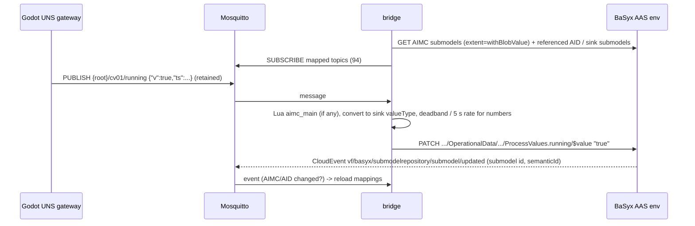
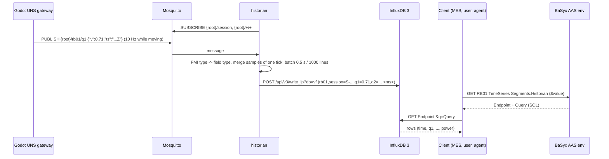
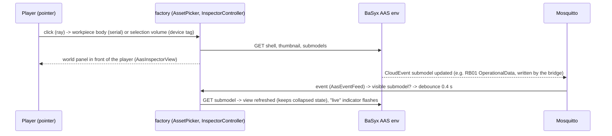

# Runtime view: OT/IT data flow (M4)

Measured on the development machine with the complete stack (`docker compose -f infra/docker-compose.yml up -d`)
and Godot in real time (`--vf-uns=ws://localhost:9001`). Services: [interfaces/services.md](../interfaces/services.md),
UNS: [interfaces/uns.md](../interfaces/uns.md).

## 1. Telemetry into the AAS (AIMC-driven)



Only state and slow values reach the AAS (ADR-0019): 104 mappings (discrete outputs, OperatingState/Hours,
EnergyConsumption). Measured with a 240 s real-time run (incl. a 45 s hold): about 175 UNS telemetry messages/s,
the bridge writes 8.2 values/s (replaying the same traffic through the old policy - every output, numbers ≤ 1/s -
gives 19.4/s, the new policy 6.9/s); the MES no longer PUTs time-series segments.

## 1a. Telemetry into the historian (ADR-0019)



The historian stores ~210 samples/s as ~90 rows/s in 2 batched write requests/s (0.5 s batches); the TimeSeries
submodel is static, so recording causes no AAS traffic. The MES reads the series of a part (cell cycle, release →
sort) with ~20 small SQL queries when the part is packed.

## 2. Life cycle of one workpiece (UNS events → BPMN → AAS)

```mermaid
sequenceDiagram
  participant G as Godot (AC01, PLC01)
  participant M as MES (events)
  participant E as Operaton
  participant W as MES worker
  participant A as BaSyx
  G->>M: event part_released {serial, leak_rate, stroke_time}
  M->>E: correlate PartReleased (businessKey = serial) -> new WorkpieceLifecycle
  E->>W: external task workpiece-create
  W->>A: PUT shell + Nameplate, DppMetadata, ExecutedProcesses (OP10-OP70), AssetLocation
  G->>M: event part_inspected {serial, result, r,g,b, delta_e}   (≈ 11 s later)
  M->>E: correlate PartInspected (retried until the instance waits)
  E->>W: workpiece-record-inspection
  W->>A: PUT ExecutedProcesses (+OP75, OP80), QualityInspection, MeasurementValue x2
  G->>M: event part_sorted {serial, container, slot}             (≈ 8 s later)
  M->>E: correlate PartSorted
  E->>W: workpiece-record-packing
  W->>A: PUT ExecutedProcesses (+OP90, Completed), CarbonFootprint, AssetLocation; KLT contents
  E->>E: gateway correctContainer? -> end / user task "Check mis-sorted part"
```

Measured: every part of a 4-minute run ended in `End_Completed`, no incidents; a workpiece AAS has 8 submodels
when packed. The instance PCF is production-based (aas-model.md §6a). Verification run (240 s real time,
AC01 missing-cap rate 0.25 → 7 of 14 packed parts rejected, line held 45 s via LineControl): a normally produced
part gets 4.7 Wh electricity + 0.6 Wh compressed air → 0.0019 kg CO₂e (A3 without losses); the part that waited
on the held line (residence 69 s instead of ~24 s) 6.1 Wh (+29 %), the part assembled during the hold (cell cycle
incl. 45 s idle) 8.5 Wh (+80 %). Rejects report 3.902 kg (components 3.9004 + energy); good parts carry the
session's losses per good part (3.90 kg at the end of the run, 11.7 kg for the first good part after three
rejects), so A1-A3 of good parts is 7.80–15.61 kg.

## 3. Agent / workflow operation through the AAS

```mermaid
sequenceDiagram
  participant C as Client (BPMN worker, agent, curl)
  participant A as BaSyx AAS env
  participant O as ops-gateway
  participant M as Mosquitto
  participant G as Godot PLC01
  Note over O,A: start-up and on BaSyx change events of the configuration submodels
  O->>A: GET LINE01/LineControl → ControlComponent → PLC01/ControlComponentInstance
  O->>A: GET PLC01/AssetInterfacesDescription (EndpointReference targets)
  O->>M: subscribe AID property packml_state + ackForms topics
  C->>A: POST LINE01/LineControl/ExecutePackMLCommand/invoke {Command: Hold}
  A->>O: POST /operations/ExecutePackMLCommand [OperationVariables]  (invocationDelegation)
  O->>O: PackML check (Hold allowed in EXECUTE?)
  O->>M: {root}/plc01/cmd/packml_command {"v":4,"corr":...}
  M->>G: command (applied before the next step, pulse)
  G->>M: cmd-resp {"corr":...,"accepted":true}; packml_state 11 (HELD)
  M->>O: ack, state
  O-->>A: [Accepted=true, State=HELD, Message]
  A-->>C: outputArguments
```

Round trip < 50 ms. A disallowed command (e.g. Start in EXECUTE) returns `Accepted=false` with the allowed commands
and is not sent to the PLC. The command topic, QoS, payload keys and the ack topic are those of the AID action behind
the Control Component endpoint `PackMLCommand` (`forms`, `input`, `ackForms`, `output`), the state topic that of
the property behind `PackMLState` (ADR-0020); editing them in BaSyx re-routes the next command.
`ExecuteSkill(Produce)` runs the same path for each PackML command needed to reach EXECUTE (e.g. Reset → Start),
after validating skill, mode and parameters against the Control Component Instance.

## 4. Production order with operator tasks

`ProductionOrder` (bpmn/production_order.bpmn): `line-start` switches off the automatic KLT exchange (if the order
asks for manual exchange) and starts the line through LineControl; every 10 s `order-progress` reads the counters
from PLC01/OperationalData. When a KLT is full the PLC suspends the line and publishes `container_full`; the MES
correlates `ContainerFull`, the event sub-process creates the user task *Exchange KLT*; completing it in Tasklist
invokes `ExchangeContainer`, the PLC exchanges the KLT and resumes. When the quantity is reached the line is stopped
and automatic exchange restored. A reject rate above the limit holds the line and creates *Investigate reject rate*.

Verified run (order of 14 good parts, manual exchange): started 14:00:48, KLT A full → operator task → exchange →
line resumed, order closed 14:04:46 with 14 good parts, line STOPPED, auto exchange restored.

## 5. In-world AAS inspector (M5, ADR-0018)



