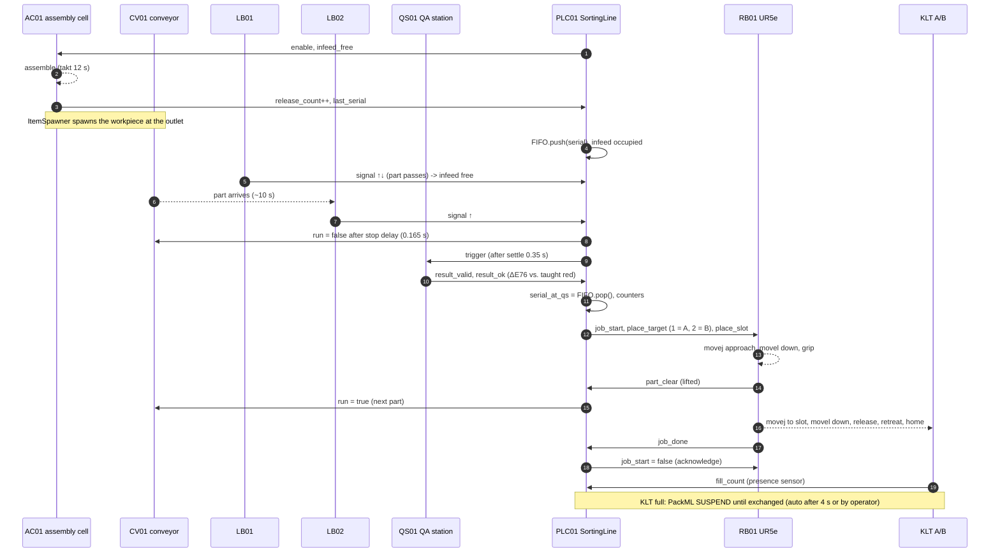

# Runtime view: life cycle of one part (M1, OT layer only)

Times are for the default layout (takt 12 s, belt 0.25 m/s). The IT side (MQTT, MES, AAS) is added in M4.

Per physics frame (`factory/factory_runtime.gd`):

1. every device's **probes** sample the world (beam raycasts, colour ray, grip/fill overlaps) → model inputs
2. `CoSimMaster.step(1/60 s)`: connections copied, `do_step` for each device, then the PLC (10 ms scans)
3. every device's **views** apply outputs (belt velocity, joint transforms, lamps, spawning, grasping)
